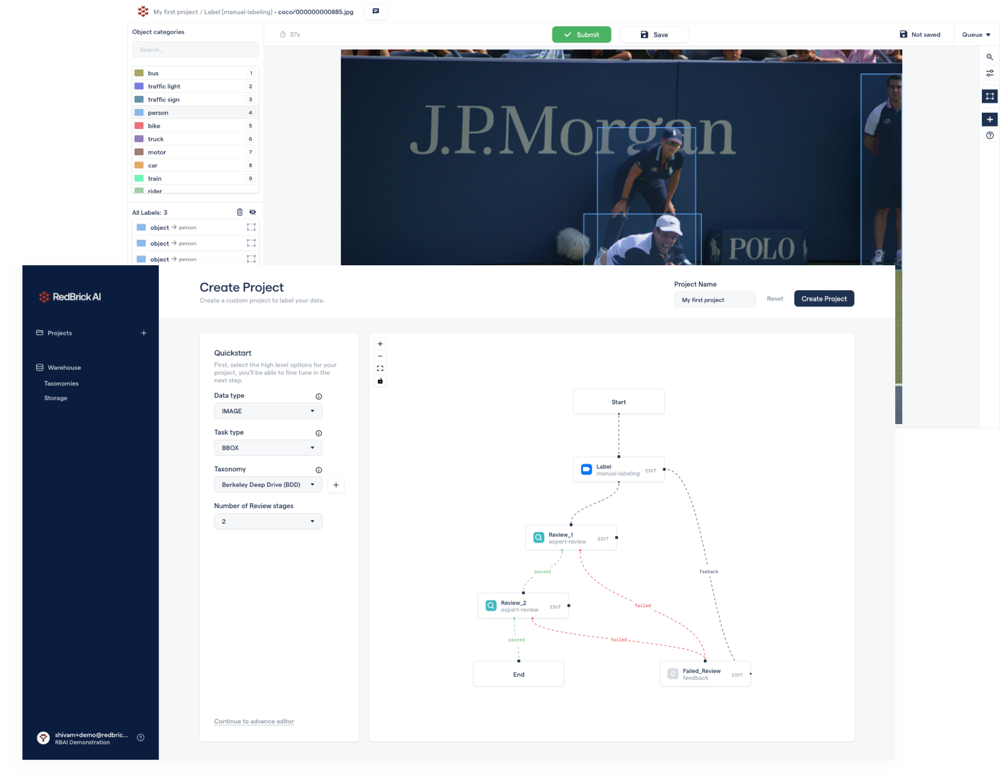

# About RedBrick AI

RedBrick AI is a software platform for creating and managing computer vision training data. Teams use the platform to **structure**, **automate** and **qualify** their labeling efforts in a collaborative way. Accelerate and manage your computer vision labeling while enforcing high quality standards at reasonable cost.

## How to Navigate the Docs

You can use this section as a quick navigation for the documentation.

### Projects

A good place to start with the documentation is the Projects section - Projects are where all annotation and data processes happen. In the docs you can learn about creating and managing projects.&#x20;


[Broken link](broken-reference)


### Organizations

Next, you can visit the Organizations section that covers how all collaboration and permissions are handled in your team. A core benefit of using the RedBrick platform is the collaborative nature of the offering. You can go through the organizations section to understand how to invite and manage your team.&#x20;


[what-is-an-organization.md](organizations/what-is-an-organization.md)


### Data Labeling

Learn how to set up and use the web based RedBrick AI data-labeling tools. The platform supports a variety of labeling types for both image and video data types, as well as tools for performing review to ensure a high quality output.&#x20;


[.](./)


### RedBrick SDK

The RedBrick python SDK provides a developer friendly way of interacting with the platform. The SDK can be used for data i/o, model pre-labeling etc. Checkout the guide for using the SDK.


[sdk-overview](python-sdk/sdk-overview/)


## Getting Access


**Request a product demo or trial**\
****\
****If you're interested to try out the RedBrick AI platform, request for a product demonstration or a trial by writing to us at [contact@redbrickai.com](mailto:contact@redbrickai.com).

