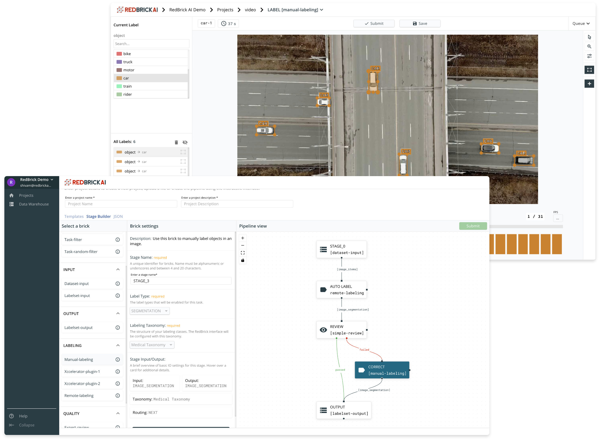

# About RedBrick AI

RedBrick AI is a software platform for creating and managing computer vision training data. Teams use the platform to **structure**, **automate** and **qualify** their labeling efforts in a collaborative way. 

## Platform Overview

The RedBrick platform has three core components that allow teams to accelerate and manage their labeling projects.

* \*\*\*\*[**Data Warehouse**](data-warehouse-1/overview.md)**:** Manage and interact with data and labels.  All machine learning projects start with data. Understand, organize, and maintain all of your training data assets within the RedBrick AI Data Warehouse. Never again deal with messy file structures, share data over email, or challenges in collaborating on datasets.  
* \*\*\*\*[**Data Pipelines:**](data-pipelines/overview.md) ****Customize to your projects requirements  Your project is unique. RedBrick AI can be configured to suit the exact requirements of your projects. Structure and automate your workflows, while maintaining deep insights into the quality and progress of your projects.  
* \*\*\*\*[**Data Labeling**](data-labeling/overview.md)**:** Generate high-quality labels, faster.   Raw data doesn't do much for you. RedBrick AI offers high performance manual and automated labeling tools right in your web browser. Make use of the quality assurance tools to maintain high-quality output. 

## RedBrick SDK

The RedBrick python SDK provides a developer friendly way of interacting with the platform. The SDK can be used for data i/o, model pre-labeling etc. Checkout the guide for using the SDK.



## Getting Access


**Request a product demo or trial**  
  
If you're interested to try out the RedBrick AI platform, request for a product demonstration or a trial by writing to us at [contact@redbrickai.com](mailto:contact@redbrickai.com).


Once you have access to the RedBrick AI platform, you can checkout out Quick Start guide to get up and running. 

