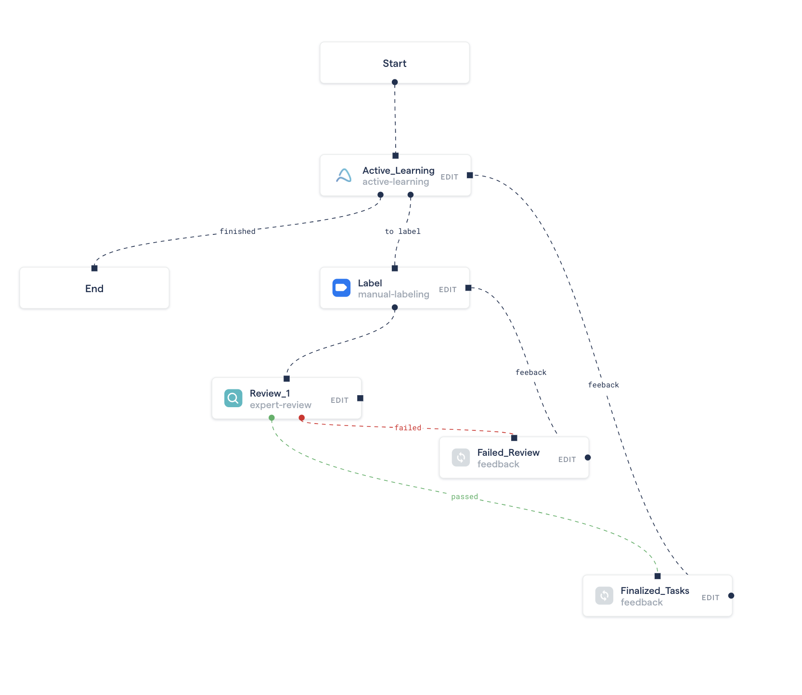

# Overview

### Introduction to Active Learning on RedBrick AI

Active learning works by using an AI model to intelligently query your dataset, so that you only label the most important data. The RedBrick AI active learning framework facilitates this by allowing you to control the active learning process and automatically handling which tasks get served to be labeled. 

**Dataset** - All datapoints in the project that can be used for active learning

**Labeled set** - The subset of the dataset that has been manually labeled and passed 

**Unlabeled set** - The subset of dataset that has not yet been manually labeled and passed through _Finalized\_Tasks_ stage

The labeled set will be used to inform your model, which will then prioritize datapoints from the unlabeled set to get labeled manually. 

All standard RedBrick AI features can be used with Active Learning such as multiple stages of review and labeling.

The basic steps for performing active learning on RedBrick AI are as follows:

1. Create a new project that utilizes an active-learning stage.
2. Upload data to the project
3. 
### 

