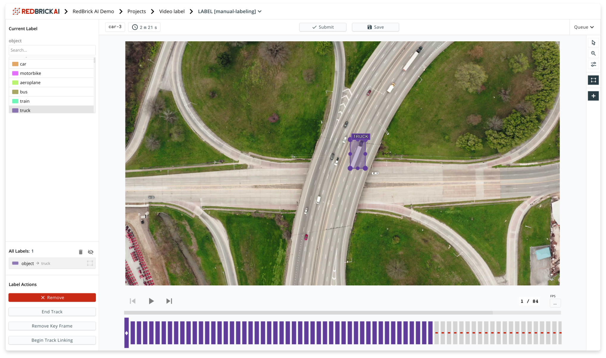
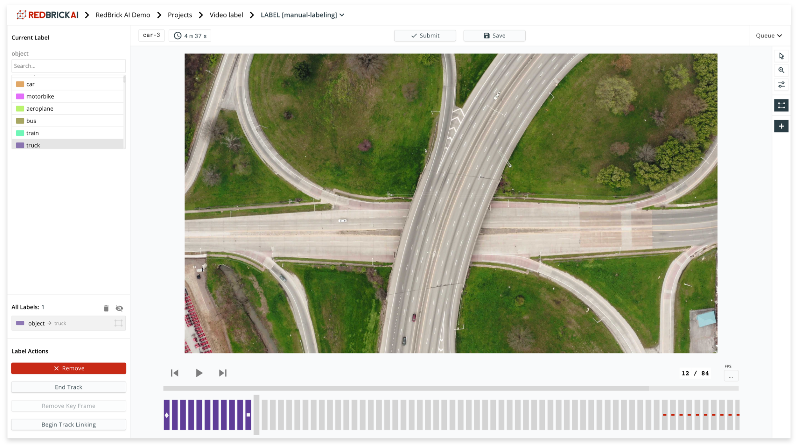

# Video Labeling

Video labeling on the RedBrick AI platform is done by parsing a video into individual frames and generating labels on those frames. When you create a video dataset and import data into the platform, you will need to create an [items list](../../data-warehouse-1/preparing-your-data.md#prepare-your-items-list) where each entry will have a `name` key.

Each unique `name` key will be created into an independent video labeling task, and the frames will be ordered in the same order of appearance of the items list.

### Video Labeling Interface

As mentioned earlier, video labeling is done by parsing the video into frames and then labeling individual frames. The RedBrick AI platform offers tools to assist in labeling these frames in a context of a video. The video labeling interface includes play controls, slider, and frame selector to help users navigate through a video.


**Video frame loading**

To optimize loading of the webpage, only 50 frames ahead of the current frame will be loaded. 


To describe the functionality of the video labeling interface, let's define a few terms that completely define a single label object in a video.

| Term | Description |
| :--- | :--- |
| `frame index` | The index of the particular frame in the video. Every label begins and ends at a particular `frame index` . By default, whenever you draw a label, it gets added for all the frames in that particular video, starting at the frame index you added it.  |
| `key frame` | Any frame where the user manually adds/edits labels is considered a `key frame` . As you can see in the image below, the user has drawn the bounding box on the cat on the first frame, and therefore that frame is marked as a `key frame` \(with the diamond\). If you wish to navigate to the 5th frame and edit the bounding box on that frame, the fifth frame will also be a `keyframe` and the bounding box will be _interpolated_ in the frames between.  |
| `track id` | Each object that you label on the interface will get a unique `track id` . In the example below, there are 50 labels \(one for each frame\) with the same `track id` which signifies a single object.  |
| `end frame` | The last frame of an object with a particular track id is the `end frame` \(denoted by the square\). As you can see in the second image below, the `end frame` is the 13th frame of the video, at which point, this particular track is finished.  |

### Video interpolation

As described in the section above, the labeling interface will linearly interpolate between all frames that have been labeled \(shown in the animation below\). 

The interpolation feature is present for both bounding box labels, as well as polygon labels: 

* **Bounding box:** Bounding box vertices are linearly interpolated between frames, you can adjust the position, and dimensions of the bounding box between frames. 
* **Polygon:** Polygon vertices are linearly interpolated between frames, you can adjust the position of each node between frames. 

