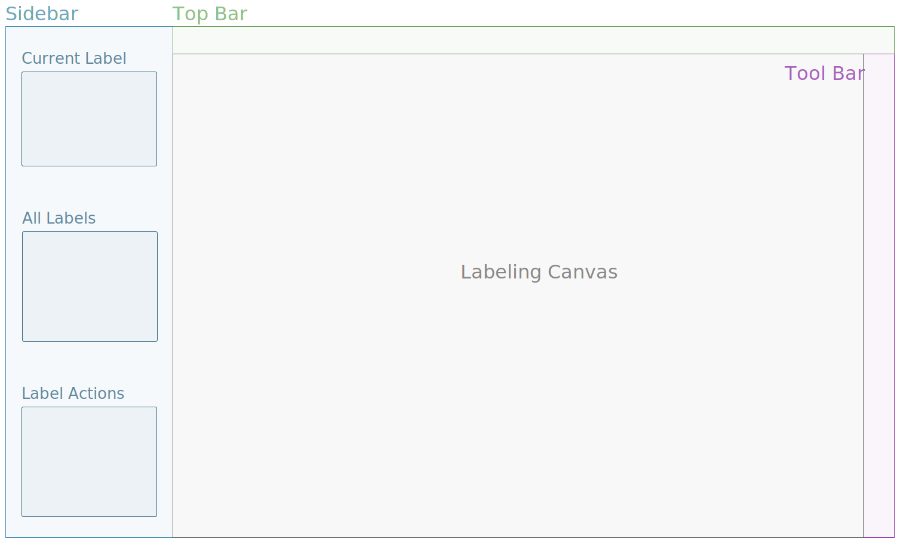
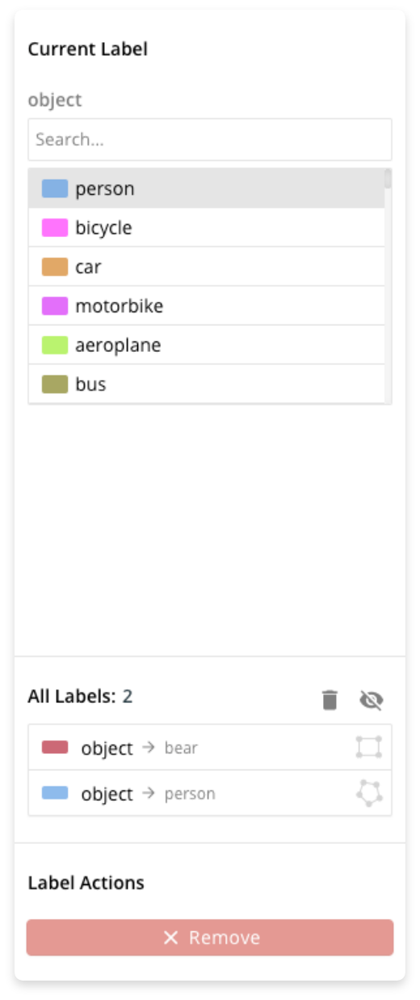
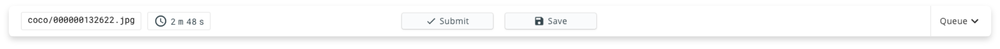
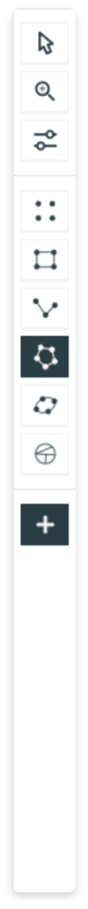
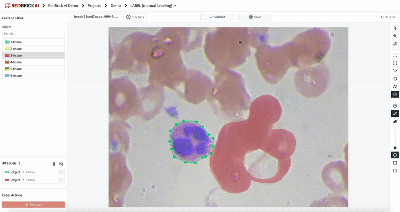
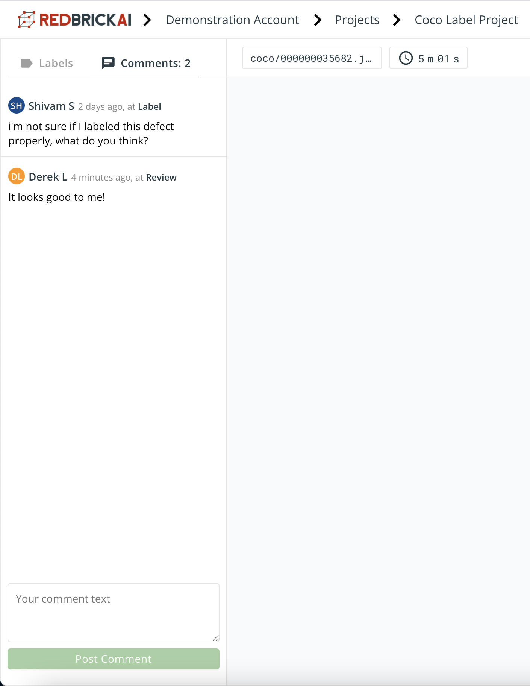

# Overview

The RedBrick AI platform offers several manual and automated tools for image and video labeling. The table below covers the current offerings of the platform:

| Data Type | Label Type | Label Type Code |
| :--- | :--- | :--- |
| `Image` | Bounding Box | `bbox` |
|  | Segmentation | `segmentation` |
|  | Polygon | `polygon` |
|  | Keypoint | `keypoint` |
|  | Ellipse | `ellipse` |
|  | Classification | `classify` |
| `Video` | Bounding Box | `bbox` |
|  | Polygon | `polygon` |
|  | Classification | `classify` |

## Labeling Interface Layout

The labeling interface is simple and easy to get started with. The figure below will help you get acquainted with the labeling tool interface. 

### Side Bar

The sidebar contains all the relevant information for adding, and modifying labels. The **current label** sections displays a list of all the classes in your taxonomy for you to label. When a created label is selected, its class will be highlighted in this list. The **all labels** sections contains a list of all the created labels. The **label actions** section contains buttons for actions like removing labels, tracking labels in videos etc.

### **Top Bar**

The top bar contains high level actions like submitting/saving tasks and accepting/reviewing tasks during quality assurance. Furthermore, the top bar contains high level information about each task - like: 

* **The data point name**: the file path, or the url of the task \(same as the [items list entry](../data-warehouse-1/preparing-your-data.md#prepare-your-items-list)\)
* **Timer**: the amount of time you have spent on this particular data point. This information is stored and provided to admins. 

### **Tool Bar**

The tool bar contains useful tools labeling actions, and tools specific to the label type you are working with. Some of the generic functions are:

* **Zoom:** zoom in and zoom out.
* **Selection tool:** disables editing on the interface. 
* **Visualization controls:** allow you to change the brightness, and contrast of the image as well as the opacity of the labels.

The tool bar also lets you choose what labeling tool you want to use if you have created your project with the _multi label type option_. 

### **Labeling Canvas**

The labeling canvas is where you will interact with the data and labels and actually add, edit, remove labels to data. Depending on the type of labels you are generating, the actions required to create/edit the labels will change. 

## Keyboard and Mouse Shortcuts 

| Mac | Windows | Description |
| :--- | :--- | :--- |
| ⌘C | Ctrl + C | Copy a label |
| ⌘V | Ctrl + V | Paste a label |
| ⌘Z | Ctrl + Z | Undo an action |
| ⌘⇧Z | Ctrl + Shift + Z | Redo an action |
| Mouse scroll | Mouse Scroll | Zoom in/out |
| esc | esc | De-select a selected label |
| delete | delete | Delete a selected label |
| w | w | Increase segmentation brush size |
| s | s | Decrease segmentation brush size |
| a | a | Previous frame in video |
| d | d | Next frame in video |

## Creating and Editing Labels

At a high level there are four actions you can perform to a label - **creating**, **selecting, and editing**.  The process for doing so is largely similar for each label type, and is briefly covered in this section. 

#### Creating labels

When you open up the labeling interface, the sidebar loads with the first label class in the taxonomy pre-selected. Interacting with the label canvas to draw a new label will create this label with the label class selected in the left panel. If you wish to change the label class, simply select another label class from the sidebar either before, or after you have created the label. 

#### Selecting and un-selecting labels

When there are already labels on the label canvas, you can select/un-select them to perform various actions on them. You can select any label from the sidebar label list; furthermore, many label types \(like bounding boxes, and polygons\) can be selected by interacting with the label canvas. A selected label will be highlighted. To un select a label, simply press the `esc` key, or select a different label. 

**Editing labels**

Once you have selected the label you want to edit, you can edit all its properties - the shape of the label, the label class, delete the label etc. When you select a label, the side bar class selector will automatically select the current label class - if you wish to change the label class, simply change the selection.

## Labeling Comments

The labeling tool allows you to leave comments about issues, questions and feedback on the labeling. The comments are accessible via the comments tab on the top left corner of the platform. 

Your team members can leave comments at any stage of the labeling workflow, and the interface will display the full history of the comments along with when it was created, which user created the comments, and at which stage in the pipeline the comment was created. 

