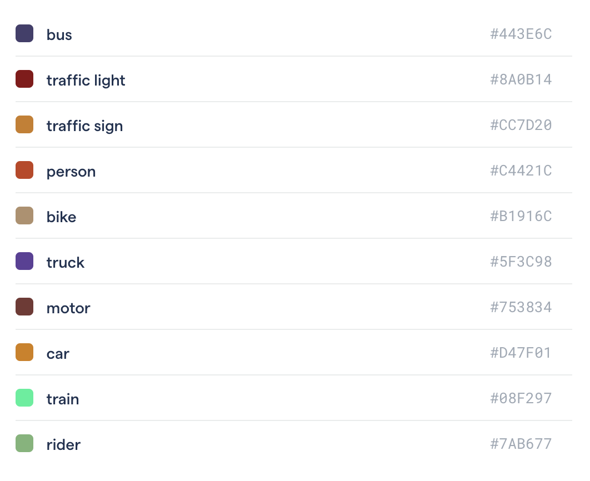
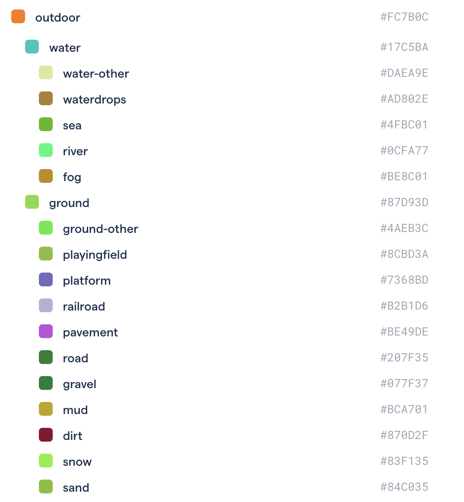
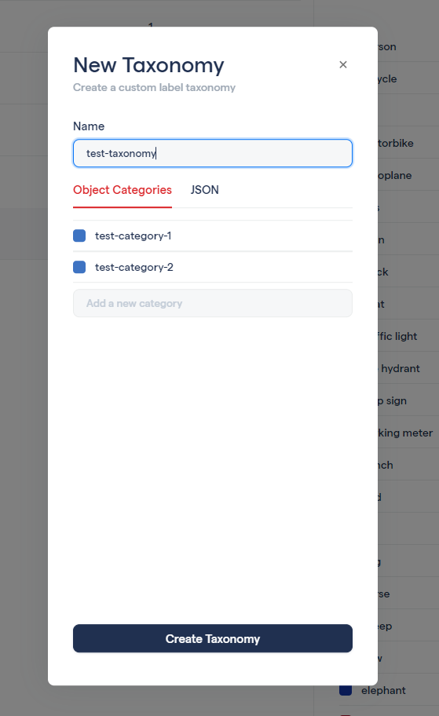

# Taxonomies

Taxonomies provides a structured way of defining your object label categories. Taxonomies allow you to re-use a set of label classes and attributes over different projects. A simple taxonomy is shown below.







```javascript
{
  "categories": [
    {
      "name": "object",
      "children": [
        {
          "name": "bus",
          "classId": 0,
          "children": []
        },
        {
          "name": "traffic light",
          "classId": 1,
          "children": []
        },
        {
          "name": "traffic sign",
          "classId": 2,
          "children": []
        },
        {
          "name": "person",
          "classId": 3,
          "children": []
        },
        {
          "name": "bike",
          "classId": 4,
          "children": []
        },
        {
          "name": "truck",
          "classId": 5,
          "children": []
        },
        {
          "name": "motor",
          "classId": 6,
          "children": []
        },
        {
          "name": "car",
          "classId": 7,
          "children": []
        },
        {
          "name": "train",
          "classId": 8,
          "children": []
        },
        {
          "name": "rider",
          "classId": 9,
          "children": []
        }
      ]
    }
  ],
}
```



Each taxonomy entry has:

* A unique category name
* A unique category ID \[0,n\) where n is the number of classes.
* A color that will be used when displaying the label. 

Each taxonomy entry can have child categories as well, up to a depth of 3 levels. 




Creating nested taxonomies through interactive UI **is coming soon.** Nested taxonomies can be created through the JSON editor. 


### Creating a taxonomy

You can either create a simple non-nested taxonomy using simple creation, or build a taxonomy from scratch using the JSON editor. Type a category name and press **enter** to add it to the taxonomy list. 



The taxonomy JSON is a list of single taxonomy entries of the following format: 

```javascript
{
    "name": "classname",
    "classId": 0,
    "children": []
}
```

The `name` field is a unique string for the object class, `classId` is a corresponding unique integer, any subclasses for this object will be inside the `children` field.   
  
In the complete example below, you can see that the root taxonomy entry `name: object` doesn't require a `classId`.

```javascript
[
  {
    "name": "object",
    "children": [
      {
        "name": "outdoor",
        "classId": 0,
        "children": [
          {
            "name": "sports",
            "classId": 1,
            "children": []
          }
        ]
      },
      {
        "name": "indoor",
        "classId": 2,
        "children": []
      }
    ]
  }
]
```

## Attributes


Label attributes are **coming soon.**


