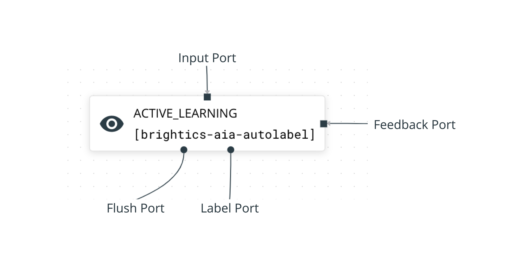

# Pipeline Bricks


For a summary of all the bricks have a look at the following [section](overview.md#bricks-overview). For a summary of the input and output types, have a look at this [section.](overview.md#input-output-types) For a list of all the label type codes look at this [section](../data-labeling/overview.md).


## dataset-input

`dataset-input` acts as a 'source' of data for your pipeline. Get data from your dataset into a pipeline using the `dataset-input` brick.

#### Configuration

* **Dataset:** The name of the dataset that will be used as the source for this brick. 

**Accepted Inputs**

* **`NONE`**

**Accepted Outputs**

* **`image_items`**
* **`video_items`**

## labelset-input

`labelset-input` acts as a 'source' of data and labels for your pipeline. If you have data and labels in a labelset, you can bring them into your pipeline using the `labelset-input`.

**Configuration**

* **Labelset:** The name of the labelset containing data/labels that will act as the source for this brick. 

**Accepted Inputs**

* **`NONE`**

**Accepted Outputs**

* **`image_<label_type>`**
* **`video_<label_type>`**

Where `<label_type>` is the type of labels in the labelset i.e. `bbox`, `classify`, `segmentation` etc. 

## labelset-output

`labelset-output` stores your data and labels in the data warehouse. Use the `labelset-output` brick to store your generated annotations in a specified labelset.

**Configuration**

* **Labelset:** The name of the labelset that will store the data/labels.  

**Accepted Inputs**

* **`image_<label_type_code>`**
* **`video_<label_type_code>`**

Where `<label_type_code>` is a [label type code](../data-labeling/overview.md) of the labels in the labelset.

**Accepted Outputs**

Accepted outputs are the same as the inputs, and the actual output type must match the input type. 


The incoming data type, label type, and taxonomy must match the types of the labelset.


## manual-labeling

`manual-labeling` allows you to create and/or edit labels on your image and video data. 

**Configuration**  
The labeling interface for this brick will be configured using these 

* **Taxonomy:** The [taxonomy](../data-warehouse-1/taxonomies.md) of the label classes that you are generating. 
* **Label Type:** The type of labels that you wish to manually generate. The selection will be one of the[ label types](../data-labeling/overview.md).

**Accepted Inputs**

* **`image_items`**
* **`video_items`**
* **`image_<label_type_code>`**
* **`video_<label_type_code>`**

**Accepted Outputs**

* **`image_<label_type_code>`**
* **`video_<label_type_code>`**

## remote-labeling

`remote-labeling` allows you to use your own model running your own system to label data using the RedBrick Python SDK.  
  
The configuration for the `remote-labeling` brick is the same as the configuration for the `manual-labeling` brick. 

## expert-review

`expert-review`allows you to review data and or labels and conditionally route the data using a pass/fail option. You can optionally edit your labels within this brick.

**Configuration**

* **Allow Edit:** Allow edit enables or disables the ability to edit labels in this brick. If disabled, then you will only be able to pass/fail the data, and not edit the labels. 

#### Allowed Inputs

* **`image_items`**
* **`video_items`**
* **`image_<label_type_code>`**
* **`video_<label_type_code>`**

**Allowed Outputs**

The allowed outputs are the same as the allowed inputs, and the actual output type must match the input type. 

## feedback

`feedback` allows you to send data to a brick upstream in your pipeline.

#### Allowed Inputs

* **`image_items`**
* **`video_items`**
* **`image_<label_type_code>`**
* **`video_<label_type_code>`**

**Allowed Outputs**

The allowed outputs are the same as the allowed inputs, and the actual output type must match the input type. 

## task-random-filter

`task-random-filter` allows you to route your data to several downstream stages based on some percentage i.e. send 50% of data to one downstream stage, and 50% to another. 

#### Configuration

* **Random Routing:** A probability between 0-1, for each downstream stage. All incoming data will be assigned this probability of moving to each downstream stage. For example, if you assign routing probabilities of 0.7 for stage1, and 0.3 for stage2, each incoming task will be assigned a 0.3 chance of going to stage2, and 0.7 chance of going to stage1. 


The routing probabilities for all downstream stages must sum to 1


**Allowed Inputs**

* **`image_items`**
* **`video_items`**
* **`image_<label_type_code>`**
* **`video_<label_type_code>`**

**Allowed Outputs**

The allowed outputs are the same as the allowed inputs, and the actual output type must match the input type. 

## brightics-aia-autolabel

`brightics-aia-autolabel` is a joint offering with Samsung SDS Brightics AI Accelerator. This brick allows users to use Samsung SDS Active Learning algorithm AutoLabel. Check out this tutorial for an end-to-end explanation of how to use this offering.   
  
The basic functionality of this brick is as follows - raw data is fed to the stage via the input port. Users can send this data downstream in the pipeline to be labeled via the label port \(this could be in a single `manual-labeling` stage, or a more complicated sub-pipeline including quality assurance etc\).

After being labeled, this data is fed back to the `brightics-aia-autolabel` stage via the feedback port. This labeled data is used to train AutoLabel, which then automatically labels the remaining data in the stage, and re-orders the internal queue such that the next time data is sent downstream via the label port, it will included auto labels and first send the low confidence labels. 

Once the AutoLabel accuracy is satisfactory \(in practice, AutoLabel will be able to automatically label your dataset once you have manually labeled 10-20% of it\), you can end this iterative cycle by flushing tasks via the Flush Port. This is usually sent to a `labelset-output` stage, but can be configured to be further labeled or reviewed. 

Details of the internal workings are covered in the sections below. 


Currently the `brightics-aia-autolabel`brick only supports image bounding box.


### Configuration

* **Input Port.** 
* **Labeling Port.**
* **Flush Port.**
* **Feedback Port.**

The `brightics-aia-autolabel` brick has two components and three actions associated with it, they are covered below. 

### Components

The `brightics-aia-autolabel` brick has two main components that enable the Active Learning process. 

1. **Task Queue.** The task queue contains all the data/labels queued in this stage, with the lowest confidence tasks at the top of the queue. Before the first ****training cycle, the queue is randomly sorted. 

   \*\*\*\*

2. **Training Set.** Tasks that have been manually labeled get added to the training set. AutoLabel is trained on this training set.

### Actions

1. **Send Batch.** The send batch action sends a batch of data from the top of the task queue inside `[brightics-aia-autolabel]`,  to the downstream `[manual-labeling]` step.  The batch size is is configurable in the stages dashboard, and can be changed every time a batch is sent to manual labeling.  
2. **Trigger Training.** The trigger training action trains AutoLabel using the labeled data inside the training set. At the end of a training cycle, AutoLabel will generate predictions with confidence values on the task queue. The task queue will be re-ordered to have the least confident predictions at the top of the queue at the end of every training cycle.  ****
3. **Flush Tasks.** The flush task action sends all the tasks \(data and labels\) queued in `[brightics-aia-autolabel]` to the `[labelset-output]` stage to be stored in the Data Warehouse. 

#### Allowed Inputs

* `image_bbox`

#### Allowed Outputs

* `image_bbox`

