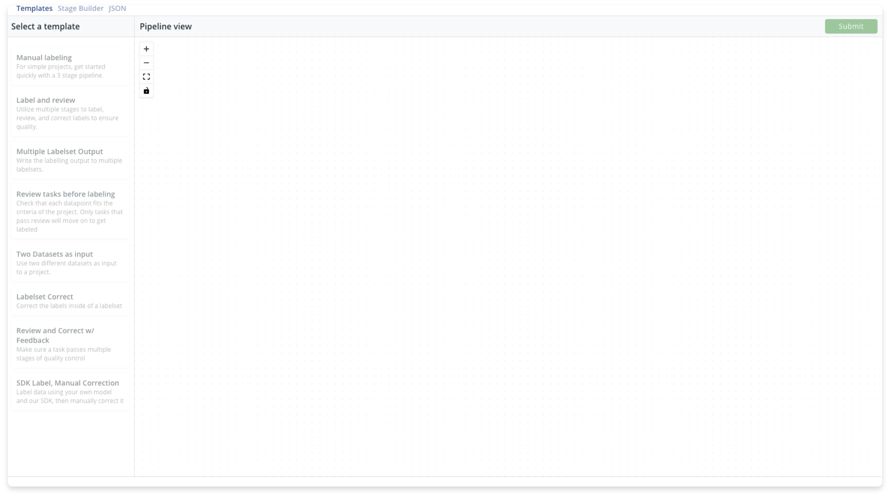

# Creating a Pipeline

## Overview

RedBrick pipelines offer you a way to structure and automate your labeling projects. Pipelines are completely configurable and provide flexibility for you to structure your projects the way you want. You can either create a pipeline from scratch using the **stage builder**, use one of our many **templates** that cover the common use cases, or directly edit the pipeline **JSON** object. 

## Templates

## Stage Builder

