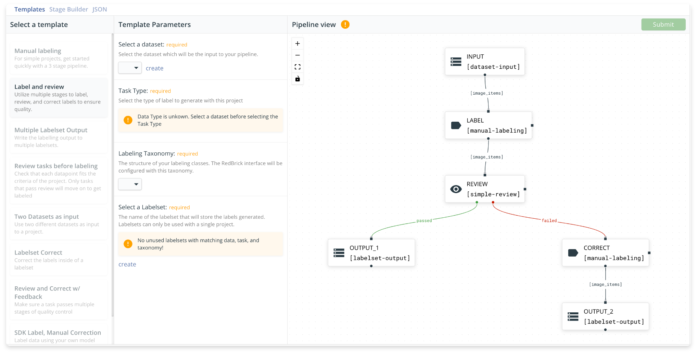
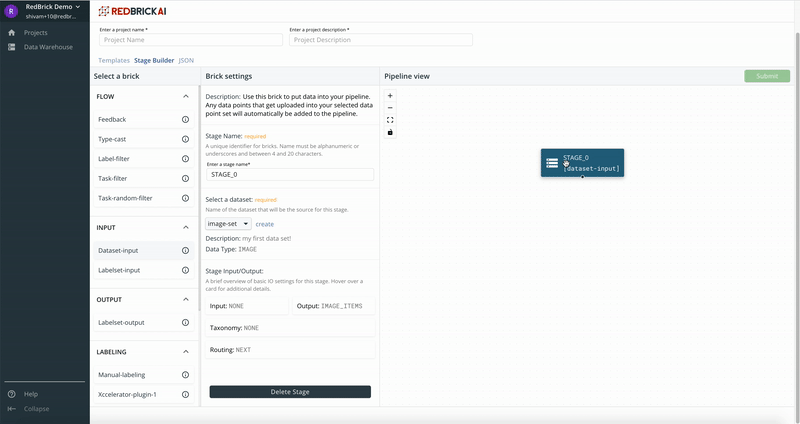

# Creating a Pipeline

## Overview

RedBrick pipelines offer you a way to structure and automate your labeling projects. Pipelines are completely configurable and provide flexibility for you to structure your projects the way you want. You can either create a pipeline from scratch using the **stage builder**, use one of our many **templates** that cover the common use cases, or directly edit the pipeline **JSON** object in the pipeline creator. 

## Templates

Template provide you a quick way of getting started with a project with little configuration needed. Select the **templates** tab in the pipeline creator to get started with a template. 

Select a template, and fill out the basic parameters under _Template Parameters_ to create a pipeline with a template. 

## Stage Builder

The pipeline stage builder has three components to it:

* **Brick Selector:** The brick selector shows all the bricks offered by RedBrick AI, and allows you to select any brick to add to the pipeline.   Selecting a brick from the brick selector will add it to the pipeline viewer. To properly add it to the pipeline, click and drag to create a connection to another brick.  
* **Brick Settings:** The brick settings tab allows you to fill out the required settings needed for each brick. Select a brick \(by clicking on it in the pipeline viewer\) to view and edit its settings.   You can **delete** stage by clicking the _delete stage_ button within the bricks settings.  
* **Pipeline Viewer:** The pipeline viewer visualizes the pipeline you are creating, and allows you to interact with the pipeline to make edits to it.   Click on a brick to select it and edit it. You can move around bricks in the viewer to change the visualization. Click and drag from an _output node_ to an _input node_  to create a connection between two bricks. 


The **black circle** on a brick denotes an **output node,** and the **black square** denotes an **input node**


