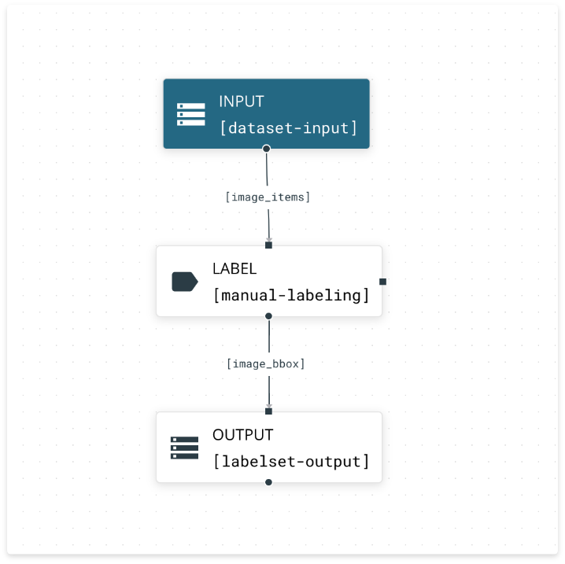
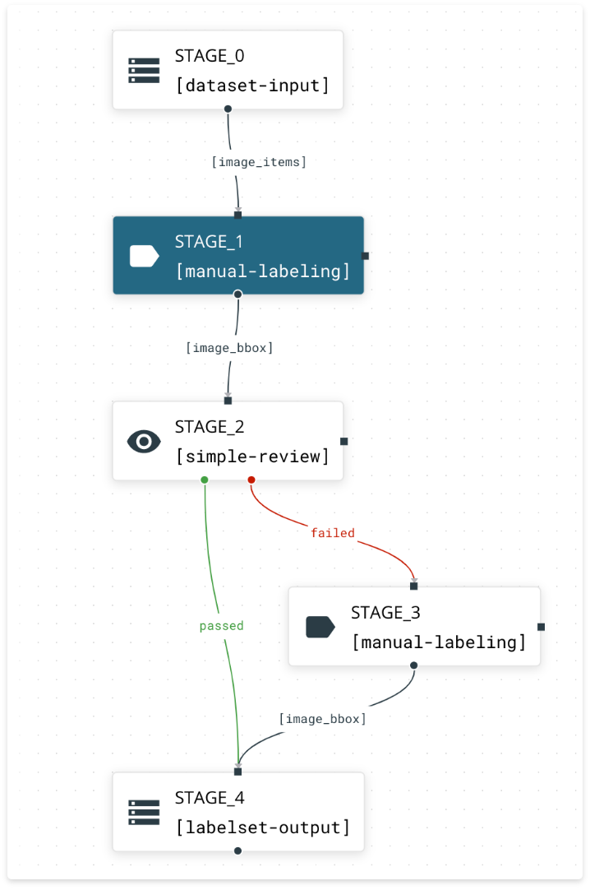

# Overview

RedBrick AI pipelines offers you a way to **automate** and **structure** your labeling projects. Often, labeling projects are multi-step processes that involve multiple stakeholders and automated resources.  
  
With the RedBrick AI pipelines, you can define workflows at the start of a project and seamlessly scale your labeling projects while maintaining **deep insights** into the **performance and progress** of your projects. Important insights are tracked by the RedBrick pipelines, and will allow you to **trace issues** throughout the lifecycle of a project and continuously product high quality training data.

## How do pipelines work?

You can think of the RedBrick pipelines as a digital assembly line comprised of several individual **bricks.** Each brick is responsible for a single action \(this can be an automated, or manual action\) and processes data and/or labels. Stages are tied together with some **routing logic** to build a pipeline. The image below shows the most basic pipeline that allows a user/or team to manually label data. 

Digging a little deeper into the simple example above, we can see everything starts with the `dataset-input` brick - raw data from the warehouse is brought into the pipeline in this step. All of these images are then routed to the `manual-labeling` step, where a team can manually label their dataset. This labeled data is then routed to the `labelset-output` which stores the assets back in the warehouse. 

Let's take a look at a slightly more complicated example.

The simple review pipeline above demonstrates the functionality of pipelines a little better. The first two steps of the pipeline are pretty straightforward, however, after the `simple-review` step, data is conditionally routed downstream to be stored, or corrected then stored. Throughout the pipelines, data will automatically get routed, meta-data will be stored, and tasks will be assigned throughout the team. 

These are just two simple examples of what workflows you can build with RedBrick AI pipelines. 

## Brick Types

As discussed above, bricks have single responsibilities and process data and labels. The RedBrick AI platform offers five different types of bricks: 

* **Input:** Input bricks act as the 'source' of a pipeline, and bring in data and labels into the pipeline. You can have multiple inputs to a project e.g. from multiple datasets. 
* **Output:** Output bricks are the 'sink' of a pipeline and are responsible for properly storing labels. You can have multiple outputs to a project e.g. different output containers for different types of labels.  
* **Labeling:** Labeling bricks are mainly responsible for creating/editing labels. These can be purely manual, or automated.  
* **Quality:** Quality bricks offer you a way to structure your quality assurance, get insight into the quality of labels, and enforce quality standards.  
* **Flow:** Flow bricks are used to route data between bricks. 

## Routing Types

As disc

