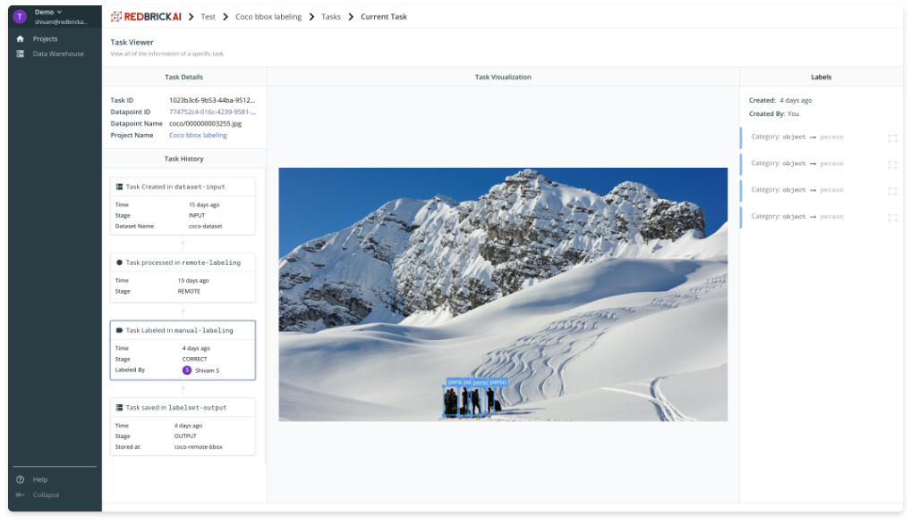

# Tasks

Tasks are an important concept to understand how the RedBrick pipeline frame work operates. Each unique data point get's a unique Data Point ID, which will look like a random string of characters and numbers like this `e768aade-0d0b-471a-b106-40a2c7b97f20`. When you create a pipeline, a single Task ID is created for each unique Data Point - the Task ID also has the same form as the Data Point ID. Everything that happens to a Data Point within a pipeline will be stored and accessible by its Task ID. 

Each Task will have a history associated with it, and a current stage in which it is queued, details are covered below.

## Task History

Each Task has a history of how it arrived to its current stage. The task history will allow you to track how the labels evolve throughout the pipeline, and will allow you to diagnose issues in your labeling workflow sooner rather than later. 

You can arrive at the task history page by heading to the url `https://app.redbrickai.com/<orgid>/projects/<projectid>/tasks/<taskid>/` or alternatively by clicking on the `task_id` in the task list table. 

## Task Queue

In stages that require manual input \(like `manual-labeling` and `expert-review`\), queued tasks can have the following statuses: 

1. **Unassigned.** These are tasks that are queued but haven't been assigned to any user in the organization yet. 
2. **Assigned.** These are tasks that are queued and have been assigned to a particular user to complete. 
3. **Completed.** These are tasks that the assigned user has completed, and tasks that would have exited the stage. 

