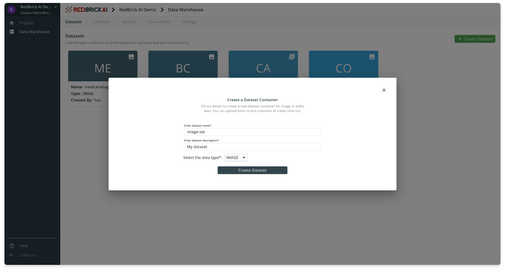
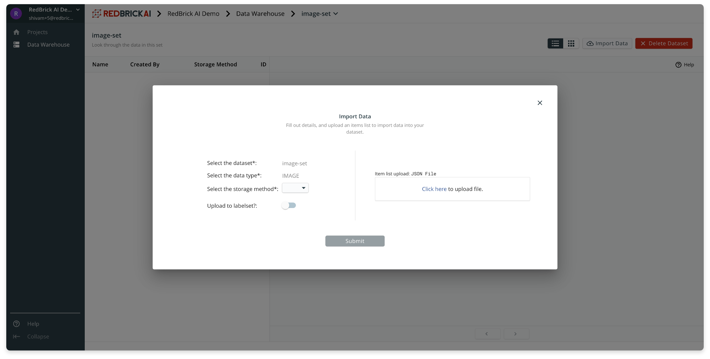

# Datasets

Datasets are containers for your raw data, you and your team can manage and interact with your raw data through the datasets. All your dataset are located within the data warehouse, and under the **Datasets** tab. 

### Creating a dataset

To a create a dataset, you can head over to the Data Warehouse using the navigation sidebar. After clicking on the green 'Create Dataset' button, you need to fill out basic information and specify whether this will be a dataset for Images, or Videos. You can create a dataset _without_ importing your data, and do this at a later time. 

### Importing data into a dataset

Once you've created a dataset, you can import data into it by clicking on your newly created dataset and clicking on the **Import Data** button on the Dataset page.

To import data into the dataset you need two things:

* Specify where your data is stored through the **storage method** field \(read the section on Storage Methods for details\).
* An **Items List**  __which can be thought of as _pointers_ to your individual datapoints inside your storage method. For more information on Items list check out the Prepare Your Data section.

