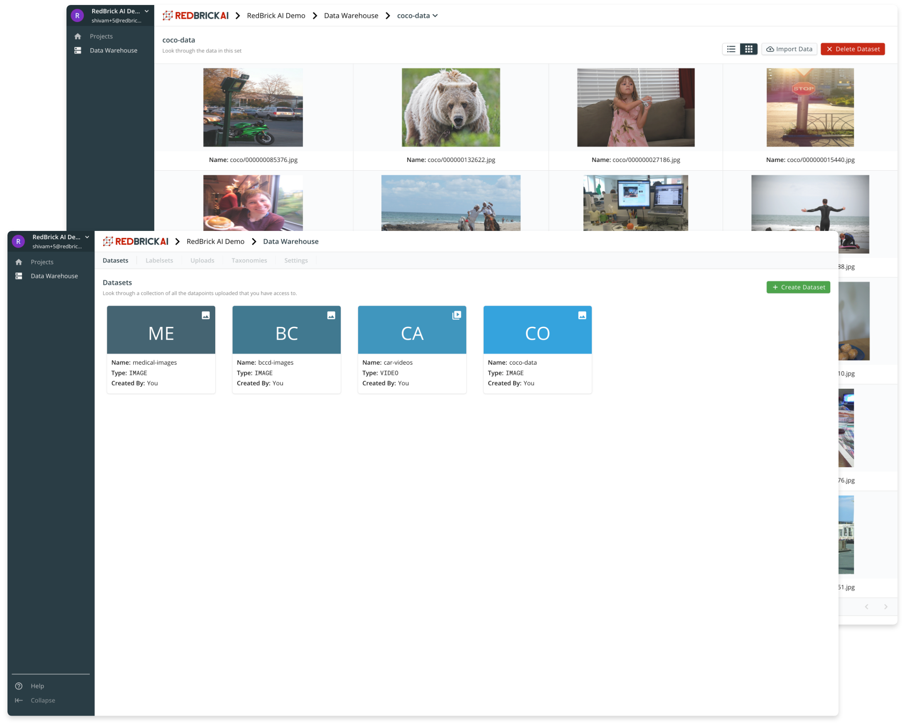
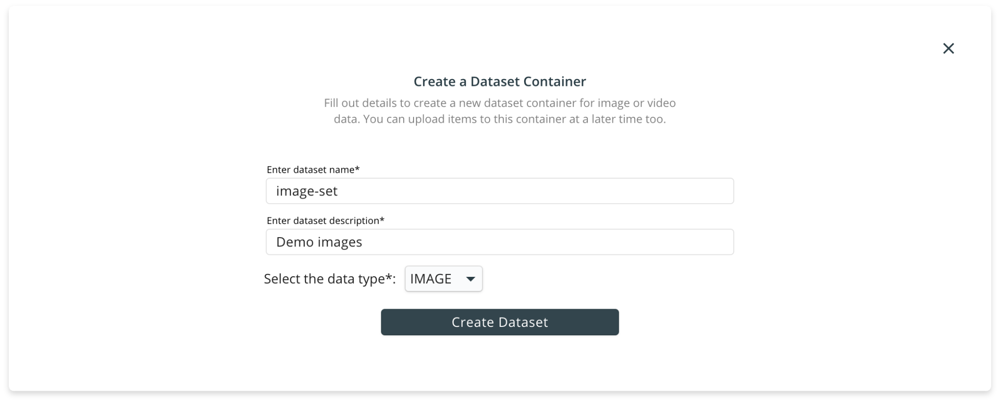
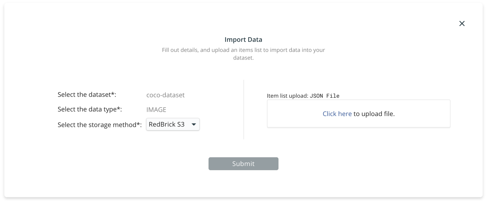
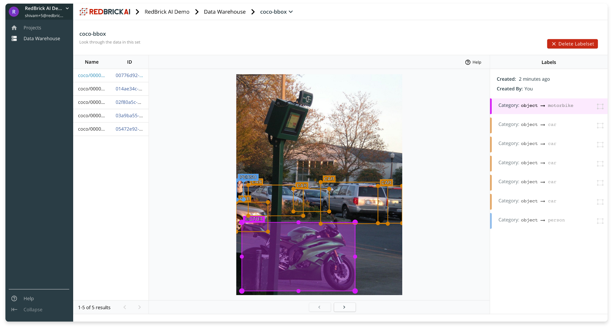
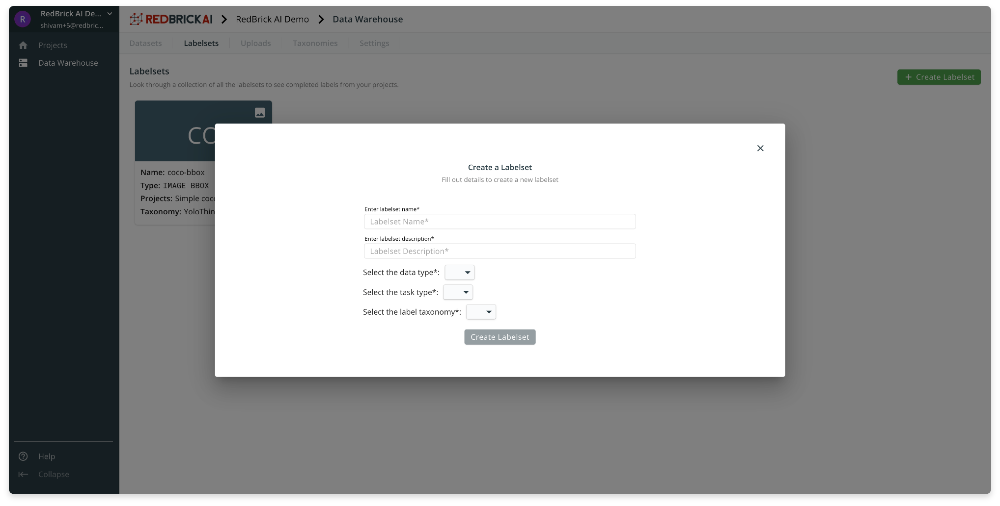

# Managing Your Sets

## Datasets

Datasets are containers for your raw data, you and your team can manage and interact with your raw data through the datasets. All your dataset are located within the data warehouse, and under the **Datasets** tab. 

### Creating a dataset

To a create a dataset, you can head over to the Data Warehouse using the navigation sidebar. After clicking on the green **Create Dataset** button, you need to fill out basic information and specify whether this will be a dataset for Images, or Videos. You can create a dataset _without_ importing your data, and do this at a later time. 

### Importing data into a dataset

Once you've created a dataset, you can import data into it by clicking on your newly created dataset and clicking on the **Import Data** button on the Dataset page.

To import data into the dataset you need two things:

* Specify where your data is stored through the [storage method](storage-methods.md) field \(read the section on Storage Methods for details\).
* An [Items List](preparing-your-data.md#prepare-your-items-list) __which can be thought of as _pointers_ to your individual data-points inside your storage method. 

Read this section for a detailed explanation of importing data into your dataset.



## Labelsets

Labelsets are containers for your labels. Usually, a project will begin at a single dataset, and the finished labels will be stored in a single labelset. The labelsets are simply named container for your data and labels. Your team can visualize and interact with the labels within the labelset.

Inside the labelset page, the viewer has three components :

* **Left Panel:** for selecting and viewing datapoints inside the labelset
* **Viewer:** visualization of data and labels in the center
* **Right Panel:** details about each label on the datapoint. 

### Creating a labelset

To create a labelset you need to specify some basic information and the data type, as well as the taxonomy of the labels. More information on taxonomies is available in the taxonomies section.

You will have to be mindful of the options you select while creating a labelset. Eventually labelsets will be used in projects to store your data and labels. Therefore, you create your labelset with the correct options in mind. 

* **Data Type:** `image` or `video` 
* **Task Type:** They type of labels you are generating `bbox` `polygon` etc. 
* **Label Taxonomy:** The label classes of the data. 

