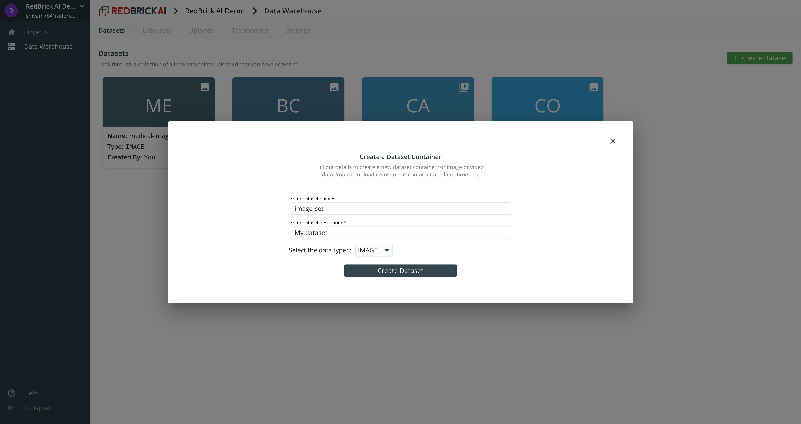

# Datasets

Datasets are containers for your raw data, you and your team can manage and interact with your raw data through the datasets.

### Creating a dataset

To a create a dataset, you can head over to the Data Warehouse using the navigation sidebar. After clicking on the green 'Create Dataset' button, you need to fill out basic information and specify whether this will be a dataset for Images, or Videos. You can create a dataset _without_ importing your data, and do this at a later time. 

