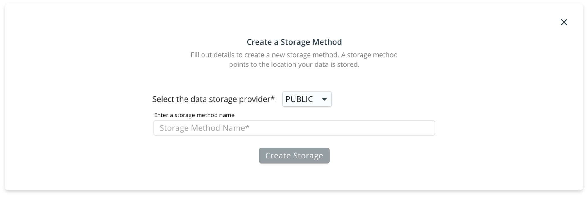

# Importing data

The data that you use with the RedBrick AI platform can be stored in a number of places, including locally on your computer, on Amazon S3, or another cloud provider. To enable this flexibility, you have to define a _Storage Method_ to tell the RedBrick AI platform where your data actually lives. Currently, the two options for storage methods are:

* [AWS S3 Buckets](../storage-methods.md#configuring-aws-s3-storage-for-redbrick-ai).
* [Google Cloud Storage.](configuring-gcs-storage.md)
* Azure Blob Storage.
* [Public](../storage-methods.md#configuring-local-machine-for-data-storage). This storage type includes data stored on your computer and data stored on any public server accessible by a URL.

You can create a storage method by heading to the _Settings_ tab inside the _Data Warehouse_, and clicking on the _Create Storage_ button.



If your data is stored on a private S3 bucket, you will need to create a storage method of type _AWS\_S3_.


Please visit the Configuring AWS Storage for RedBrick AI section for a detailed walkthrough on how to generate all the required parameters. A brief overview of each parameter is provided here:

* `Unique name`: A unique identifier for this storage method.
* `Bucket Name`: The name of your AWS S3 Bucket.
* `Region`: The region code of the S3 bucket, e.g. us-east-2 \(US East Ohio\), ap-south-1 \(Asia Pacific Mumbai\). Check out the [aws docs](https://docs.aws.amazon.com/AWSEC2/latest/UserGuide/using-regions-availability-zones.html) for a list of all the region code.
* `Access Key`, `Secret Key`: The two keys that enable secure data operations. Follow along Configuring AWS Storage for RedBrick AI to generate the keys for your bucket.





Please visit the Configuring GCS Storage for RedBrick AI section for a detailed walkthrough on how to generate all the required parameters. A brief overview of each parameter is provided here:

* `Unique Name`: A unique identifier for this storage method.
* `Bucket Name`: The name of your GCS Bucket.
* `Service Account details`: A JSON key that provides RedBrick AI with adequate permissions to access data within the bucket. 




**Coming Soon!**




Public storage methods are used for data that can be accessed using a URL \(without authentication\). This includes data that is stored locally on your computer - read through the [Configuring Local Machine for Data Storage](https://docs.redbrickai.com/platform/warehouse/prepare-data/#configure-local-machine-for-data-storage) section for instructions on how to make your local data available for use.





## Uploading an items list

The data that you use with the RedBrick AI platform can be stored in a number of places, including locally on your computer, on Amazon S3, or another cloud provider. The RedBrick AI data warehouse integrates with your existing storage method to give you full control over the data privacy and access. 

To import data into your dataset, you need to: 

* [Create a dataset.](../creating.md#creating-a-dataset)
* Select the [storage method](../storage-methods.md) to which you want to integrate to.
* Upload an [items list](../preparing-your-data.md#prepare-your-items-list) specifying which data-points from your storage method you want to import.

## Prepare Your Items List

The items list points the RedBrick AI platform to the data points in the data storage. This way you can selectively import data points from a storage method. The items list is a JSON file which comprises of a list of entries of the following format.

```javascript
{
    "url": "<filepath_of_datapoint>",
    "name": "<name_of_datapoint>" // Needed for videos
}
```

Here is a sample item list entry for each of the possible storage methods.



Say your datapoint `image.png` is stored inside a folder named `folder` inside an s3 bucket, the item list entry for that datapoint will be.

```javascript
{ 
  "url": "folder/image.png" 
}
```



Say your data point `image.png` is stored inside a folder named `folder` which is being hosted using an http server on `http://127.0.0.1:8000/`, the item list entry for that datapoint will be.

```javascript
{
  "url": "http://127.0.0.1:8000/folder/image.png"
}
```



Say your datapoint is hosted at a public endpoint `https://path/to/data/image.png`, the item list entry for that datapoint will be.

```javascript
{
  "url": "https://path/to/data/image.png"
}
```



### Image Items List

The items list for importing images into the RedBrick AI platform is simply a list of item list entries. Each entry will be a single datapoint on the RedBrick AI platform. The item list below will import three data points into the RedBrick AI platform.

```javascript
  [
    {
      "url": "folder1/image1.png"
    },
    {
      "url": "folder1/image2.png"
    },
    {
      "url": "folder2/image1.png"
    }
  ]
```

### Video Items List

The items list for importing images into the RedBrick AI platform is slightly different than images. Videos have to be parsed into frames and be imported into the RedBrick AI platform. Say you have two videos - `video1`, `video2`, that you want to import into the platform, and each video has three frames - `frame1.png`, `frame2.png`, `frame3.png`. The items list for this would be.

```javascript
  [
    {
      "url": "video1_folder/frame1.png",
      "name": "video1"
    },
    {
      "url": "video1_folder/frame2.png",
      "name": "video1"
    },
    {
      "url": "video1_folder/frame3.png",
      "name": "video1"
    },
    {
      "url": "video2_folder/frame1.png",
      "name": "video2"
    }
    {
      "url": "video2_folder/frame2.png",
      "name": "video2"
    }
    {
      "url": "video2_folder/frame3.png",
      "name": "video2"
    }
  ]
```

Using this items list, two video data points \(video1, video2\) will be imported into the platform with three frames each. The frames of each video will be ordered in the same order as their appearance in the items list.

### Programmatically Generate Items List For S3

If you don't have a standard naming convention for your files inside your s3 bucket, or you're not sure which files are in the s3 bucket, you can use the AWS CLI to enumerate a list of all the objects inside a bucket. Using this list, you can programmatically generate an items list.

#### Installing and Configuring the AWS CLI <a id="installing-and-configuring-the-aws-cli"></a>

Have a look at the [AWS documentation](https://docs.aws.amazon.com/cli/latest/userguide/install-cliv2.html) for installing the CLI. For mac users, running `brew install awscli` is the easiest way to install the AWS CLI.

Once you have the AWS CLI installed, you need to configure the cli with your AWS root account Access Key and Secret Key to give permissions to AWS CLI. After installing AWS CLI, do the following.

```bash
$ aws configure
AWS Access Key ID [None]: <your_access_key>
AWS Secret Access Key [None]: <your_secret_key>
Default region name [None]:
Default output format [None]:
```

After filling out your keys, you can leave the last two fields empty.

Now that your AWS CLI is configured, you can list out the objects inside your s3 bucket by running the following command.

```bash
$ aws s3 ls s3://<your_bucket_name>
```

After listing out all the images inside the s3 bucket \(or a folder in the bucket\), you can save the output to a txt file and write a simple script to convert that output into a JSON file in the format of the Items List covered above.

