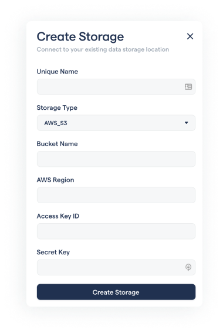
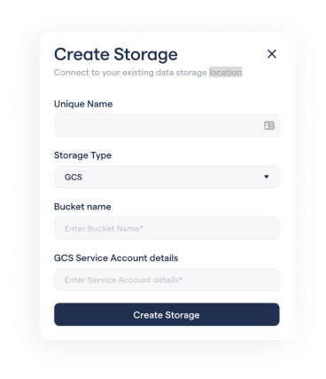

# Importing data

The data that you use with the RedBrick AI platform can be stored in a number of places, including locally on your computer, on Amazon S3, or another cloud provider. To enable this flexibility, you have to define a _Storage Method_ to tell the RedBrick AI platform where your data actually lives. Currently, the two options for storage methods are:

* [AWS S3 Buckets](../storage-methods.md#configuring-aws-s3-storage-for-redbrick-ai).
* Google Cloud Storage.
* Azure Blob Storage.
* [Public](../storage-methods.md#configuring-local-machine-for-data-storage). This storage type includes data stored on your computer and data stored on any public server accessible by a URL.

You can create a storage method by heading to the _Settings_ tab inside the _Data Warehouse_, and clicking on the _Create Storage_ button.



If your data is stored on a private S3 bucket, you will need to create a storage method of type _AWS\_S3_.

Please visit the Configuring AWS Storage for RedBrick AI section for a detailed walkthrough on how to generate all the required parameters. A brief overview of each parameter is provided here:

* `Unique name`: A unique identifier for this storage method.
* `Bucket Name`: The name of your AWS S3 Bucket.
* `Region`: The region code of the S3 bucket, e.g. us-east-2 \(US East Ohio\), ap-south-1 \(Asia Pacific Mumbai\). Check out the [aws docs](https://docs.aws.amazon.com/AWSEC2/latest/UserGuide/using-regions-availability-zones.html) for a list of all the region code.
* `Access Key`, `Secret Key`: The two keys that enable secure data operations. Follow along Configuring AWS Storage for RedBrick AI to generate the keys for your bucket.




Please visit the Configuring GCS Storage for RedBrick AI section for a detailed walkthrough on how to generate all the required parameters. A brief overview of each parameter is provided here:

* `Unique Name`: A unique identifier for this storage method.
* `Bucket Name`: The name of your GCS Bucket.
* `Service Account details`: A JSON key that provides RedBrick AI with adequate permissions to access data within the bucket. 




**Coming Soon!**




Public storage methods are used for data that can be accessed using a URL \(without authentication\). This includes data that is stored locally on your computer - read through the [Configuring Local Machine for Data Storage](https://docs.redbrickai.com/platform/warehouse/prepare-data/#configure-local-machine-for-data-storage) section for instructions on how to make your local data available for use.




