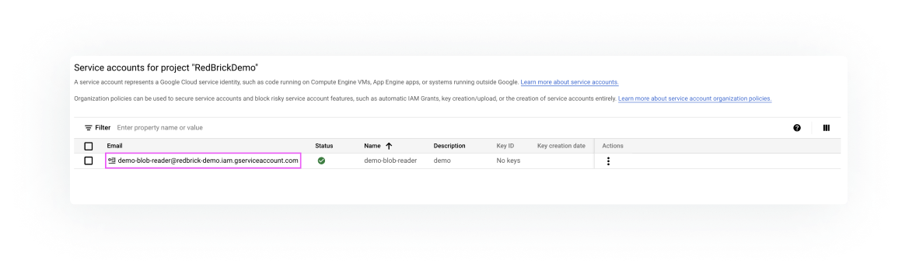

# Configuring GCS Storage

This section covers how to prepare your GCS storage to import data into the RedBrick AI platform. After following the instructions in this section, you will be able to create an GCS  'storage method' on the RedBrick platform to connect your GCS bucket to your RedBrick account.

#### Signing up for Google Cloud Platform

The first step tp preparing data storage on GCP is to [create a account](https://cloud.google.com/) on GCP.

#### Create a bucket within a project

Once you have created your GCP account and a project within your account, a bucket and upload your data within the bucket either through the UI or CLI. You can leave all the settings during creation as the default. After creating your bucket, upload your data into the bucket. 

#### Create a Service Account

A service account is a special kind of account used by an application or a virtual machine \(VM\) instance, not a person. Applications use service accounts to make authorized API calls, authorized as either the service account itself, or as Google Workspace or Cloud Identity users through domain-wide delegation.

1. In the Cloud Console, go to the [Service Accounts](https://console.cloud.google.com/iam-admin/serviceaccounts) page.
2. Select the appropriate project.
3. Click Create service account.
4. Enter a service account name to display in the Cloud Console.

   For eg, `gcs-blob-reader`

   The Cloud Console generates a service account ID based on this name. Edit the ID if necessary. You cannot change the ID later.

5. _Optional:_ Enter a description of the service account.
6. Click Create and continue to the next step.
7. Add the following two IAM roles to grant to the service account on the project.
   1. **Storage Object Viewer** \(For reading the blobs from the GCS bucket\)
   2. **Service Account Token Creator** \(For pre-signing the blobs\)
8. Once done adding roles, click Continue.
9. Click Done to finish creating the service account.
10. Note down the email id of the newly created service account.

#### 

