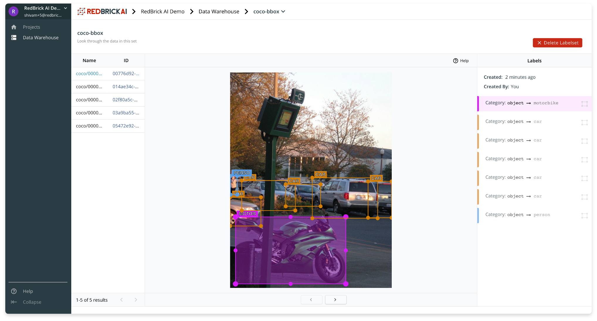
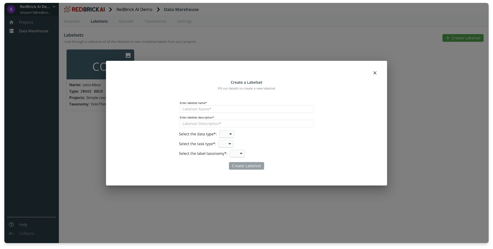

# Labelsets

Labelsets are containers for your labels. Usually, a project will begin at a single dataset, and the finished labels will be stored in a single labelset. The labelsets are simply named container for your data and labels. Your team can visualize and interact with the labels within the labelset.

Inside the labelset page, the viewer has three components :

* **Left Panel:** for selecting and viewing datapoints inside the labelset
* **Viewer:** visualization of data and labels in the center
* **Right Panel:** details about each label on the datapoint. 

### Creating a labelset

To create a labelset you need to specify some basic information and the data type, as well as the taxonomy of the labels. More information on taxonomies is available in the taxonomies section.

You will have to be mindful of the options you select while creating a labelset. Eventually labelsets will be used in projects to store your data and labels. Therefore, you create your labelset with the correct options in mind. 

* **Data Type:** `image` or `video` 
* **Task Type:** They type of labels you are generating `bbox` `polygon` etc. 
* **Label Taxonomy:** The label classes of the data. 

