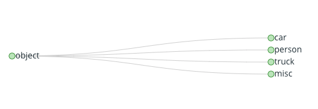
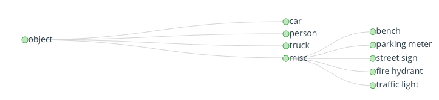

# Overview

The Data Warehouse is a central location to manage all your data and label assets. Enable **seamless collaboration** on your training data assets, and never deal with messy file structures or ad-hoc structure again. Your team can upload data from on-premise servers, third-party cloud providers, or store data with RedBrick AI. 

There are three main components to the Data Warehouse:

* [Sets](creating.md)**:** Containers for your data and label assets.
* [Storage Methods](storage-methods.md)**:** Information connecting the RedBrick AI platform to the actual storage location of your data.
* [Taxonomies](taxonomies.md)**:** The structure of your label classes for a particular set.

## Sets

Sets are containers for your data and label assets. To give users full flexibility and control over their assets, the RedBrick AI platform allows several options for data storage, which are defined by storage methods. While your data actually lives in your specified storage method, it is organized and presented on the RedBrick platform within a set.   
  
Your data is contained inside a **Dataset** and labels are contained within a **Labelset**. Usually, projects begin with a Dataset and finish with the labels stored in one or more Labelsets.

#### Datasets 

Datasets are containers for your raw data, you and your team can manage and interact with your raw data through the datasets.

#### Labelsets

Labelsets are containers for your labels. Usually, a project will begin at a single dataset, and the finished labels will be stored in a single labelset. Your team can visualize and interact with the labels within the labelset.  
  
Inside the labelset page, the viewer has three components - the table on the left that contains the list of all the datapoints with labels in this labelset, the center label viewer, and the label selection panel on the right.



## Storage Methods

The data that you use with the RedBrick AI platform can be stored in a number of places, including locally on your computer, on Amazon S3, or another cloud provider. To enable this flexibility, you have to define a [Storage Method](storage-methods.md) to tell the RedBrick AI platform where your data actually lives. Currently, the two options for storage methods are:

* [AWS S3](preparing-your-data.md#configuring-aws-s3-storage-for-redbrick-ai) Buckets
* [Public](preparing-your-data.md#configuring-local-machine-for-data-storage). This storage type includes data stored on your computer and data stored on any public server accessible by a URL.



## Taxonomies

Taxonomies provides a structured way of defining what label classes exist in a labelset. For example, if you're labeling a simple dataset containing the following objects `car`, `people` and `people`, you would create a labelset with a taxonomy that contains those objects. The taxonomy configures the labelset as well as the labeling interface to allow you to actually label the data.

Taxonomies are tree structures to allow complete flexibility on how you decide to label your data. You can create a simple taxonomy, which is a tree of depth 1.

Taxonomies can also be nested objects, which gives you increased specificity over your label classes - each label class can have sub classes. The maximum depth of a taxonomy tree is 3.



