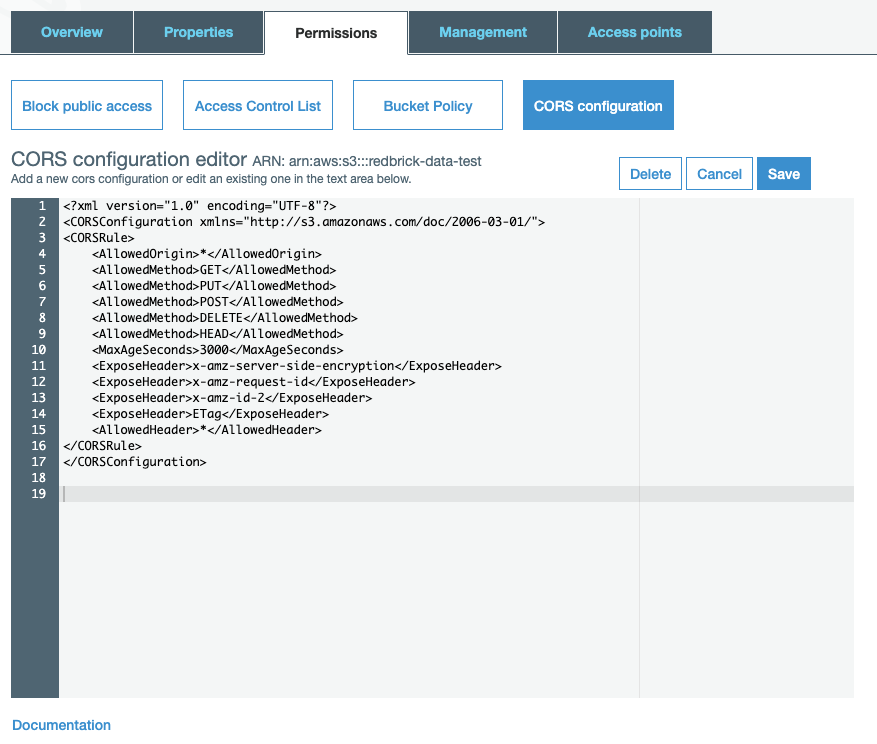

# Preparing Your Data

The RedBrick AI platform aims to give users maximum flexibility on how they want to import and manage data on the RedBrick AI platform, while keeping in mind key concerns of data privacy. For this reason, you can use cloud hosted data, or locally stored data with the RedBrick AI platform.

Currently, RedBrick AI supports private cloud hosted data on AWS S3, locally stored data, or publicly available stored data on any server. With the data stored on one of these locations, you can simply provide us with 'pointers' to the datapoints to allow the platform to retrieve the data when needed. This way the data never goes through RedBrick Ai servers, and simply stays between your storage location, and your browser. There are two steps to preparing your data for the platform.

#### Prepare the data storage method <a id="prepare-the-data-storage-method"></a>

Your data storage method is where your data actually lives. Dataset containers use a storage method to actually import data into the RedBrick AI platform. 

* [AWS S3 Storage](preparing-your-data.md#configuring-aws-s3-storage-for-redbrick-ai): Configure a S3 bucket for use with the RedBrick Ai platform. 
* [Local Storage](preparing-your-data.md#configuring-local-machine-for-data-storage): Set up your local machine to host your data for use with the RedBrick AI platform. 

**Create an items list**

The items list is a configuration file that describes the location of datapoints in the storage method. The items list will be responsible for actually enumerating which datapoints in your storage method will be imported into RedBrick AI.

* Image Data: Create the configuration file the specifies what videos to import.  
* Video Data: Create the configuration file that specifies what images to import.

## Configuring AWS S3 Storage for RedBrick AI

This section covers how to prepare your Amazon S3 storage to import data into the RedBrick AI platform. After following the instructions in this section, you will be able to create an Amazon S3 'storage method' on the RedBrick platform to connect your S3 bucket to your RedBrick account.

#### Signing Up for AWS <a id="signing-up-for-aws"></a>

The first step to preparing data storage on Amazon S3, is to sign up for an aws account on [https://aws.amazon.com.](https://aws.amazon.com/)

#### Create an S3 Bucket <a id="create-an-s3-bucket"></a>

Once you are logged in to your AWS account, head over to the Amazon S3 console. Create a new bucket, and keep all the default settings \(you can choose to change the region of the S3 bucket\). After creating your S3 bucket, upload your images through the User Interface, or use the AWS CLI for large amounts of data.

#### S3 Bucket Settings <a id="s3-bucket-settings"></a>

To ensure your data is private and secured, RedBrick uses presigned URL's to render data in browsers. To allow RedBrick to use presigned URL's to serve data, you need to define a CORS policy on the S3 bucket. [Here](https://docs.aws.amazon.com/AmazonS3/latest/dev/cors.html) is the AWS S3 documentation on CORS.

To set the proper CORS policy, go to the Permissions tab in your S3 bucket. Under Permissions select the CORS configuration and copy paste the following block of code.

```markup
<?xml version="1.0" encoding="UTF-8"?>
<CORSConfiguration xmlns="http://s3.amazonaws.com/doc/2006-03-01/">
<CORSRule>
    <AllowedOrigin>*</AllowedOrigin>
    <AllowedMethod>GET</AllowedMethod>
    <AllowedMethod>PUT</AllowedMethod>
    <AllowedMethod>POST</AllowedMethod>
    <AllowedMethod>DELETE</AllowedMethod>
    <AllowedMethod>HEAD</AllowedMethod>
    <MaxAgeSeconds>3000</MaxAgeSeconds>
    <ExposeHeader>x-amz-server-side-encryption</ExposeHeader>
    <ExposeHeader>x-amz-request-id</ExposeHeader>
    <ExposeHeader>x-amz-id-2</ExposeHeader>
    <ExposeHeader>ETag</ExposeHeader>
    <AllowedHeader>*</AllowedHeader>
</CORSRule>
</CORSConfiguration>
```

This is what it looks like on the S3 console.



#### Access and Secret Keys <a id="access-and-secret-keys"></a>

If your S3 Bucket blocks public access to the data, you will have to create an IAM user to allow RedBrick to securely access the data in your S3 bucket. AWS IAM enables you to manage access to your AWS services. You can read about IAM in the [AWS documentation](https://docs.aws.amazon.com/IAM/latest/UserGuide/id_users.html).

To create an IAM user from the AWS console, follow these steps:

* Sign in to the AWS Management Console and open the IAM console
* In the IAM console navigation pane, choose Users and then choose Add user.

Add User

* Type the user name for the new user.
* Select Programmatic Access

Permissions

* Click on Attach existing policies directly
* Create a new policy
* Paste the following block of JSON inside the JSON tab. Remember to replace `<your_s3_bucket_name_here>` with the name of the S3 bucket that has your data. You can modify the Resource path for added security or specificity.

```javascript
{
  "Version": "2012-10-17",
  "Statement": [
    {
      "Sid": "RedBrickLabelingReadOnly",
      "Effect": "Allow",
      "Action": "s3:GetObject",
      "Resource": "arn:aws:s3:::<your_s3_bucket_name_here>/*"
    }
  ]
}
```

* Review your policy and create it.
* Head back to your IAM user creation and attach the policy you just created.


**Granular Permissions**  
  
You can configure your S3 bucket to give RedBrick AI access to particular data points inside your s3 bucket by modifying the "Resource" section in the file above. 


Create the user

* Create the user and download Access and Secret key .csv
* Store the CSV file with your keys carefully.

## Configuring Local Machine for Data Storage


**Local Storage Drawbacks**  
  
If you store the data on your local machine, you will not be able leverage any of the collaboration features of the RedBrick AI platform. Configuring local storage is recommended for small single person projects or individual experimentation.


This section will cover how to configure your local machine to store data for use with the RedBrick AI platform. To allow the RedBrick AI platform to access data from your local machine, you will have to start an http server through which your data will be hosted. There are several packages that enable this:



```bash
$ npm install --global http-server # Mac users can do brew install http-server
$ http-server path/to/data
```



```bash
$ python -m http.server --directory path/to/data
```



Once you start your http server, you will be able to see your data in the browser by using the a path like `http://127.0.0.1:8000/path/to/data/img.png`.

## Prepare Your Items List

The items list points the RedBrick AI platform to the data points in the data storage. This way you can selectively import datapoints from a storage method. The items list is a JSON file which comprises of a list of entries of the following format.

```javascript
{
    "url": "<filepath_of_datapoint>",
    "name": "<name_of_datapoint>" // Needed for videos
}
```

Here is a sample item list entry for each of the possible storage methods.



Say your datapoint `image.png` is stored inside a folder named `folder` inside an s3 bucket, the item list entry for that datapoint will be.

```javascript
{ 
  "url": "folder/image.png" 
}
```



Say your data point `image.png` is stored inside a folder named `folder` which is being hosted using an http server on `http://127.0.0.1:8000/`, the item list entry for that datapoint will be.

```javascript
{
  "url": "http://127.0.0.1:8000/folder/image.png"
}
```



Say your datapoint is hosted at a public endpoint `https://path/to/data/image.png`, the item list entry for that datapoint will be.

```javascript
{
  "url": "https://path/to/data/image.png"
}
```



### Image Items List

The items list for importing images into the RedBrick AI platform is simply a list of item list entries. Each entry will be a single datapoint on the RedBrick AI platform. The item list below will import three datapoints into the RedBrick AI platform.

```javascript
  [
    {
      "url": "folder1/image1.png"
    },
    {
      "url": "folder1/image2.png"
    },
    {
      "url": "folder2/image1.png"
    }
  ]
```

### Video Items List

The items list for importing images into the RedBrick AI platform is slightly different than images. Videos have to be parsed into frames and be imported into the RedBrick AI platform. Say you have two videos - `video1`, `video2`, that you want to import into the platform, and each video has three frames - `frame1.png`, `frame2.png`, `frame3.png`. The items list for this would be.

```javascript
  [
    {
      "url": "video1_folder/frame1.png",
      "name": "video1"
    },
    {
      "url": "video1_folder/frame2.png",
      "name": "video1"
    },
    {
      "url": "video1_folder/frame3.png",
      "name": "video1"
    },
    {
      "url": "video2_folder/frame1.png",
      "name": "video2"
    }
    {
      "url": "video2_folder/frame2.png",
      "name": "video2"
    }
    {
      "url": "video2_folder/frame3.png",
      "name": "video2"
    }
  ]
```

Using this items list, two video datapoints \(video1, video2\) will be imported into the platform with three frames each. The frames of each video will be ordered in the same order as their appearance in the items list.

### Programmatically Generate Items List For S3

If you don't have a standard naming convention for your files inside your s3 bucket, or you're not sure which files are in the s3 bucket, you can use the AWS CLI to enumerate a list of all the objects inside a bucket. Using this list, you can programmatically generate an items list.

#### Installing and Configuring the AWS CLI <a id="installing-and-configuring-the-aws-cli"></a>

Have a look at the [AWS documentation](https://docs.aws.amazon.com/cli/latest/userguide/install-cliv2.html) for installing the CLI. For mac users, running `brew install awscli` is the easiest way to install the AWS CLI.

Once you have the AWS CLI installed, you need to configure the cli with your AWS root account Access Key and Secret Key to give permissions to AWS CLI. After installing AWS CLI, do the following.

```bash
$ aws configure
AWS Access Key ID [None]: <your_access_key>
AWS Secret Access Key [None]: <your_secret_key>
Default region name [None]:
Default output format [None]:
```

After filling out your keys, you can leave the last two fields empty.

Now that your AWS CLI is configured, you can list out the objects inside your s3 bucket by running the following command.

```bash
$ aws s3 ls s3://<your_bucket_name>
```

After listing out all the images inside the s3 bucket \(or a folder in the bucket\), you can save the output to a txt file and write a simple script to convert that output into a JSON file in the format of the Items List covered above.

