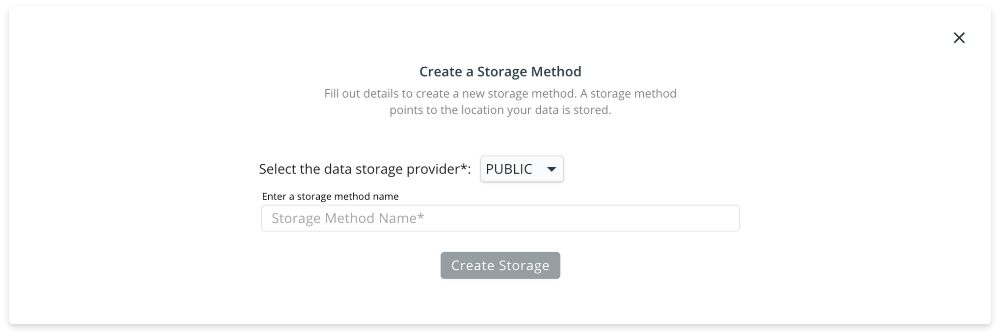

# Storage Methods

The data that you use with the RedBrick AI platform can be stored in a number of places, including locally on your computer, on Amazon S3, or another cloud provider. To enable this flexibility, you have to define a _Storage Method_ to tell the RedBrick AI platform where your data actually lives. Currently, the two options for storage methods are:

* [AWS S3 Buckets](storage-methods.md#configuring-aws-s3-storage-for-redbrick-ai).
* [Public](storage-methods.md#configuring-local-machine-for-data-storage). This storage type includes data stored on your computer and data stored on any public server accessible by a URL.

You can create a storage method by heading to the _Settings_ tab inside the _Data Warehouse_, and clicking on the _Create Storage_ button.



If your data is stored on a private S3 bucket, you will need to create a storage method of type _AWS\_S3_.


Please visit the Configuring AWS Storage for RedBrick AI section for a detailed walkthrough on how to generate all the required parameters. A brief overview of each parameter is provided here:

* `Storage Method Name`: A unique identifier for this storage method.
* `Bucket Name`: The name of your AWS S3 Bucket.
* `Region`: The region code of the S3 bucket, e.g. us-east-2 \(US East Ohio\), ap-south-1 \(Asia Pacific Mumbai\). Check out the [aws docs](https://docs.aws.amazon.com/AWSEC2/latest/UserGuide/using-regions-availability-zones.html) for a list of all the region code.
* `Access Key`, `Secret Key`: The two keys that enable secure data operations. Follow along Configuring AWS Storage for RedBrick AI to generate the keys for your bucket.



Public storage methods are used for data that can be accessed using a URL \(without authentication\). This includes data that is stored locally on your computer - read through the [Configuring Local Machine for Data Storage](https://docs.redbrickai.com/platform/warehouse/prepare-data/#configure-local-machine-for-data-storage) section for instructions on how to make your local data available for use.





## Configuring AWS S3 Storage for RedBrick AI

This section covers how to prepare your Amazon S3 storage to import data into the RedBrick AI platform. After following the instructions in this section, you will be able to create an Amazon S3 'storage method' on the RedBrick platform to connect your S3 bucket to your RedBrick account.

#### Signing Up for AWS <a id="signing-up-for-aws"></a>

The first step to preparing data storage on Amazon S3, is to sign up for an AWS account on [https://aws.amazon.com.](https://aws.amazon.com/)

#### Create an S3 Bucket <a id="create-an-s3-bucket"></a>

Once you are logged in to your AWS account, head over to the Amazon S3 console. Create a new bucket, and keep all the default settings \(you can choose to change the region of the S3 bucket\). After creating your S3 bucket, upload your images through the User Interface, or use the AWS CLI for large amounts of data.

#### S3 Bucket Settings <a id="s3-bucket-settings"></a>

To ensure your data is private and secured, RedBrick uses pre-signed URL's to render data in browsers. To allow RedBrick to use pre-signed URL's to serve data, you need to define a CORS policy on the S3 bucket. [Here](https://docs.aws.amazon.com/AmazonS3/latest/dev/cors.html) is the AWS S3 documentation on CORS.

To set the proper CORS policy, go to the Permissions tab in your S3 bucket. Under Permissions select the CORS configuration and copy paste the following block of code.

```markup
<?xml version="1.0" encoding="UTF-8"?>
<CORSConfiguration xmlns="http://s3.amazonaws.com/doc/2006-03-01/">
<CORSRule>
    <AllowedOrigin>*</AllowedOrigin>
    <AllowedMethod>GET</AllowedMethod>
    <AllowedMethod>PUT</AllowedMethod>
    <AllowedMethod>POST</AllowedMethod>
    <AllowedMethod>DELETE</AllowedMethod>
    <AllowedMethod>HEAD</AllowedMethod>
    <MaxAgeSeconds>3000</MaxAgeSeconds>
    <ExposeHeader>x-amz-server-side-encryption</ExposeHeader>
    <ExposeHeader> x-amz-request-id</ExposeHeader>
    <ExposeHeader>x-amz-id-2</ExposeHeader>
    <ExposeHeader>ETag</ExposeHeader>
    <AllowedHeader>*</AllowedHeader>
</CORSRule>
</CORSConfiguration>
```

This is what it looks like on the S3 console


#### Access and Secret Keys <a id="access-and-secret-keys"></a>

If your S3 Bucket blocks public access to the data, you will have to create an IAM user to allow RedBrick to securely access the data in your S3 bucket. AWS IAM enables you to manage access to your AWS services. You can read about IAM in the [AWS documentation](https://docs.aws.amazon.com/IAM/latest/UserGuide/id_users.html).

To create an IAM user from the AWS console, follow these steps:

* Sign in to the AWS Management Console and open the IAM console
* In the IAM console navigation pane, choose Users and then choose Add user.

Add User

* Type the user name for the new user.
* Select Programmatic Access

Permissions

* Click on Attach existing policies directly
* Create a new policy
* Paste the following block of JSON inside the JSON tab. Remember to replace `<your_s3_bucket_name_here>` with the name of the S3 bucket that has your data. You can modify the Resource path for added security or specificity.

```javascript
{
  "Version": "2012-10-17",
  "Statement": [
    {
      "Sid": "RedBrickLabelingReadOnly",
      "Effect": "Allow",
      "Action": "s3:GetObject",
      "Resource": "arn:aws:s3:::<your_s3_bucket_name_here>/*"
    }
  ]
}
```

* Review your policy and create it.
* Head back to your IAM user creation and attach the policy you just created.


**Granular Permissions**  
  
You can configure your S3 bucket to give RedBrick AI access to particular data points inside your s3 bucket by modifying the "Resource" section in the file above. 


Create the user

* Create the user and download Access and Secret key .csv
* Store the CSV file with your keys carefully.

## Configuring Local Machine for Data Storage


**Local Storage Drawbacks**  
  
If you store the data on your local machine, you will not be able leverage any of the collaboration features of the RedBrick AI platform. Configuring local storage is recommended for small single person projects or individual experimentation.


This section will cover how to configure your local machine to store data for use with the RedBrick AI platform. To allow the RedBrick AI platform to access data from your local machine, you will have to start an http server through which your data will be hosted. There are several packages that enable this:



```bash
$ npm install --global http-server # Mac users can do brew install http-server
$ http-server path/to/data
```



```bash
$ python -m http.server --directory path/to/data
```



Once you start your http server, you will be able to see your data in the browser by using the a path like `http://127.0.0.1:8000/path/to/data/img.png`.

