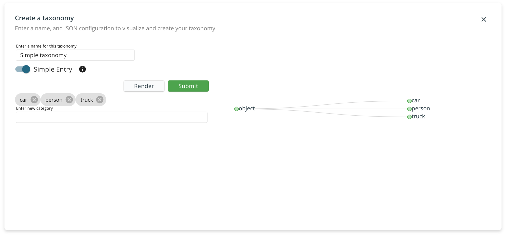

# Label Class Taxonomies

Taxonomies provides a structured way of defining what label classes exist in a labelset. Taxonomies are tree structures to allow complete flexibility on how you decide to label your data. You can create a simple taxonomy, which is a tree of depth 1.







```javascript
{
"name": "object",
"children": [
    {
        "name": "car",
        "classId": 0,
        "children": []
    },
    {
        "name": "person",
        "classId": 1,
        "children": []
    },
    {
        "name": "truck",
        "classId": 2,
        "children": []
    },
    {
        "name": "misc",
        "classId": 3,
        "children": [
            {
                "name": "bench", 
                "classId": "4",
                "children": []
            },
            {
                "name": "parking meter", 
                "classId": "5",
                "children": []
            },
            {
                "name": "street sign", 
                "classId": "6",
                "children": []
            },
            {
                "name": "fire hydrant", 
                "classId": "7",
                "children": []
            },
            {
                "name": "traffic light", 
                "classId": "8",
                "children": []
            }
        ]
    }
]
}
```



Taxonomies can also be nested objects, which gives you increased specificity over your label classes - each label class can have sub classes. The maximum depth of a taxonomy tree is 3.







```javascript
{
"name": "object",
"children": [
    {
        "name": "car",
        "classId": 0,
        "children": []
    },
    {
        "name": "person",
        "classId": 1,
        "children": []
    },
    {
        "name": "truck",
        "classId": 2,
        "children": []
    },
    {
        "name": "misc",
        "classId": 3,
        "children": [
            {
                "name": "bench", 
                "classId": 4,
                "children": []
            },
            {
                "name": "parking meter", 
                "classId": 5,
                "children": []
            },
            {
                "name": "street sign", 
                "classId": 6,
                "children": []
            },
            {
                "name": "fire hydrant", 
                "classId": 7,
                "children": []
            },
            {
                "name": "traffic light", 
                "classId": 8,
                "children": []
            }
        ]
    }
]
}
```



### Creating a taxonomy

You can either create a simple non-nested taxonomy using simple creation, or build a taxonomy from scratch using the json editor. 



The taxonomy JSON is a list of single taxonomy entries of the following format: 

```javascript
{
    "name": "classname",
    "classId": 0,
    "children": []
}
```

The `name` field is a unique string for the object class, `classId` is a corresponding unique integer, any subclasses for this object will be inside the `children` field.   
  
In the complete example below, you can see that the root taxonomy entry `name: object` doesn't require a `classId`.

```javascript
[
  {
    "name": "object",
    "children": [
      {
        "name": "outdoor",
        "classId": 0,
        "children": [
          {
            "name": "sports",
            "classId": 1,
            "children": []
          }
        ]
      },
      {
        "name": "indoor",
        "classId": 2,
        "children": []
      }
    ]
  }
]
```

