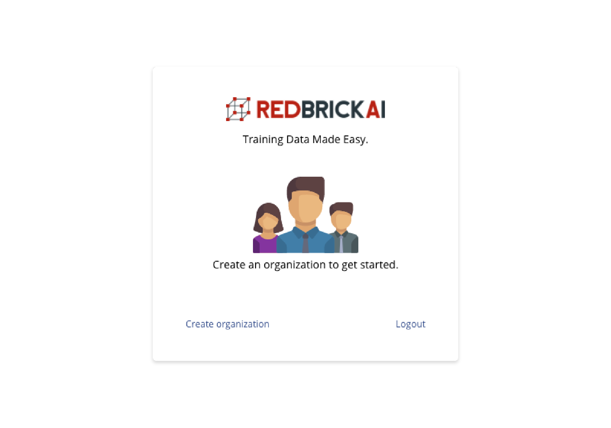
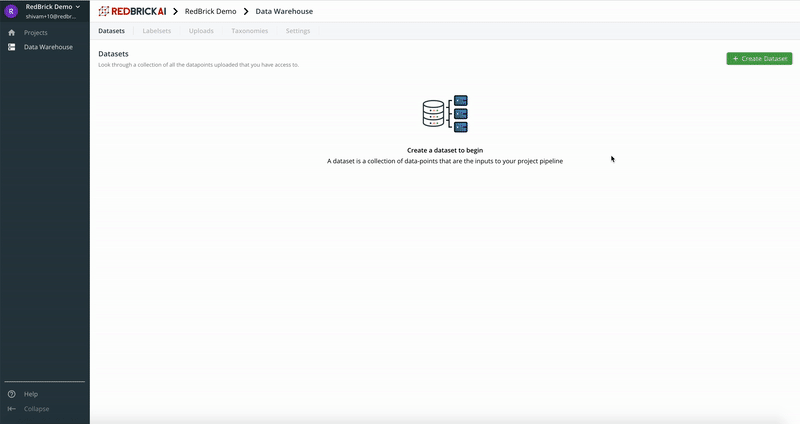
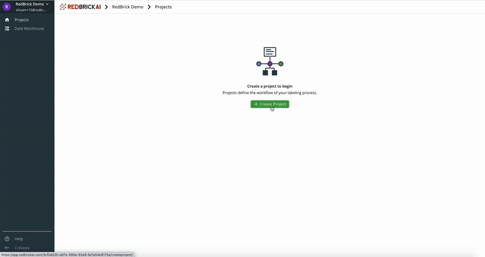
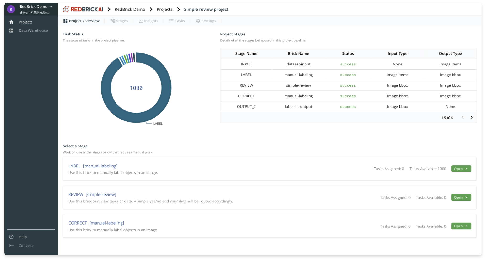
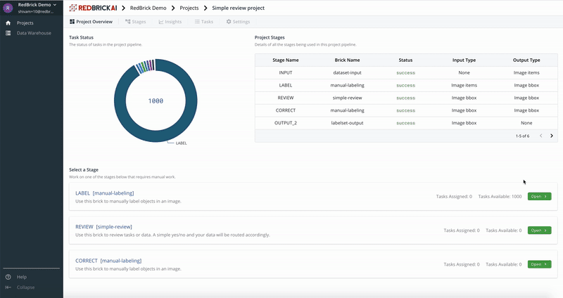

# Quick Start

## Sign In and Create an Organization

Once you have a RedBrick account, head over to the [platform](https://app.redbrickai.com/login), and login to your account. After signing in, you will be redirected to the organizations page, where you will be prompted to create an [organization](../organizations/what-is-an-organization.md).

An organization is the container inside which all your assets \(like projects, datasets etc\) live. You can also invite people to your organization to collaborate. Once you create an organization, you will be redirected to the main application where you can begin exploring the features. 

## Create a Dataset

All projects start with data, and on the RedBrick platform, you can manage raw datasets inside the [data warehouse.](../data-warehouse-1/overview.md#datasets) Datasets are containers for your raw data - we understand the importance of data privacy and security; therefore, we have separated the notion of datasets from data storage. 

Your actual data can be stored on your own servers, or your own cloud servers like AWS S3. The RedBrick Data Warehouse will integrate with your [storage method](../data-warehouse-1/storage-methods.md), and securely import data into a dataset. Follow along with the [following guide](../data-warehouse-1/preparing-your-data.md) to prepare data for import. Once you have prepared your dataset - 

* Create your [storage method](../data-warehouse-1/storage-methods.md) to tell RedBrick AI where your data is stored. 
* [Create a dataset](../data-warehouse-1/creating.md#creating-a-dataset), and import your data using an [items list](../data-warehouse-1/preparing-your-data.md#prepare-your-items-list).

With your data now securely imported into the RedBrick Data Warehouse, you can  now interact with your data inside the dataset viewer. 

## Create a Project Using a Template

Projects define your labeling efforts. You can label raw data, perform quality assurance, label data using a pre-trained model, inspect progress/performance etc. all within a project. Projects will be your home-base on RedBrick AI.    
  
With your dataset created, we can set up a project to begin a labeling project. Head to the projects page by click the _projects_ link on the left sidebar. Then click on _Create  Project_ to head over to the project creator. 

Creating a project requires two things:

* Project name and description
* Project pipeline. 

You can read more about creating a pipeline in [this section](../data-pipelines/creating-a-pipeline.md). For this quick start guide, we will just get started by selecting the _Label and Review_ pipeline template. In the _Template Parameters_ section, select the dataset we have just created, the type of labels you wish to create, the [taxonomy](../data-warehouse-1/taxonomies.md) of your label classes, and create a labelset to store your data in the warehouse.

Enter a name and project description and click submit to create the project. 

## Label Data

After creating the project, click on the project card to head over to the the project dashboard. The **Project Overview** section displays some basic stats of the project, stages, as well as displays some actions you can perform in a stage. 

Once the project has finished creating, you will see all the data points that were in the dataset you created will be created into tasks, and be queued in the first stage of the pipeline \(LABEL\).

Click on the _Open_ button on the _LABEL_ stage card to open the labeling interface and begin labeling in the first stage of the pipeline. You can read more about the labeling interface and using the labeling tools in [this section](../data-labeling/overview.md).

If you have a look at the pipeline we created for this project, all the data labeled in the first stage will automatically be routed to the second step of the pipeline - REVIEW. After review, the data will conditionally be routed to be corrected or be stored in the data warehouse.   
  
Throughout this process, tasks will automatically move through the pipeline and automatically be assigned to users to work on. All the meta-data and history of each data point through the pipeline will be tracked. 

## Evaluate Progress

## Export Data and Labels

