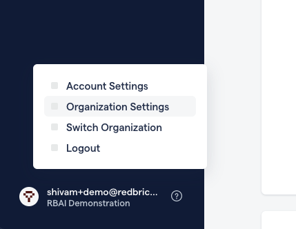
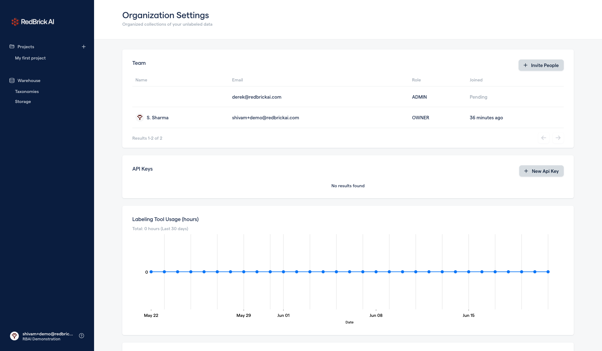

# Teams and Permissions

## Permissions

When you invite collaborators to your organization, you can select their permissions. Their is a single owner of each organization, and there can be unlimited Admins and Labelers. 

| Role | What they can access |
| :--- | :--- |
| Owner | Has access to all assets within an organization, and ability create, edit, and delete assets including the organization itself.  |
| Admin | Same permissions as an Owner, except does not have the ability to delete an organization. |
| Labeler | Only able to access manual labeling and review stages. Only has access to projects, and not the data warehouse.  |

## Sending Invitations

To invite collaborators to your organization, you can head to your Organization Settings and Invite people by specifying their email and desired permission level in the **Team** card. 

