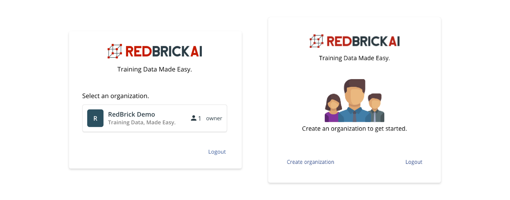
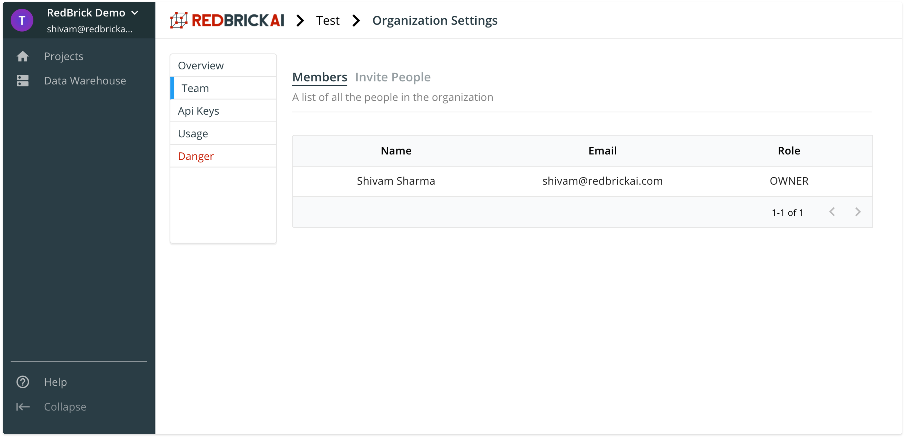

# What Is an Organization?

Organizations are containers within which projects, datasets, pipelines etc live. Permissions and collaboration on projects are handled within projects. When you log in to the RedBrick platform for the first time, you will be prompted to create an organization:

Once you create an organization, you will be able to invite members to collaborate with. Note by default, you will only be able to create one organization, but will be able to be a part of multiple organizations. If you wish to create more than one organization, please reach out to us at [contact@redbrickai.com](mailto:contact@redbrickai.com).

## Organization Invites

As an owner, or admin of your organization \(see [documentation on permissions](what-is-an-organization.md#permissions)\), you will be able to invite your colleagues to join your RedBrick AI organization. To invite collaborators, go to organization settings page, accessible by clicking the top left of the sidebar. 

Under the **Members** tab you will be able to see all the members in the current organization, as well as the permission level. Under the **Invite People** tab, you can invite a team member to collaborate, by entering the email they have used to sign up with a RedBrick AI account, and selecting their permission level. 

## Organization Usage

As an admin, or organization owner, under the **Usage tab** on the organization settings page, you will be able to monitor the platform usage for your entire organizations. The two metrics tracked over here are the number of hours spent on the labeling tools, and the number of task events. 

* **Labeling tool hours.** This a count of the number of hours spent on the labeling interface by your organization. There is a [timer](../data-labeling/overview.md#top-bar) on the labeling interface to show you the count when you are labeling.  
* **Task Events.** A single task event is a single data-point moving through a single stage in a pipeline. For example, if you have 100 images going through three stages in your pipeline, the number of task events consumed will be $$3 \times 100 = 300. $$

## Permissions 

User permissions are handled within organizations, and currently the platform supports three levels of permissions.

| Role | What the can access |
| :--- | :--- |
| Owner | Has access to all assets within an organization, and ability create, edit, and delete assets including the organization itself.  |
| Admin | Same permissions as an Owner, except does not have the ability to delete an organization. |
| Labeler | Only able to access manual labeling and review stages. Only has access to projects, and not the data warehouse.  |

