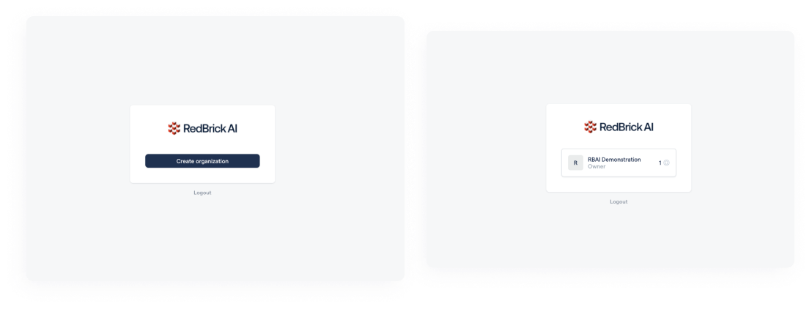
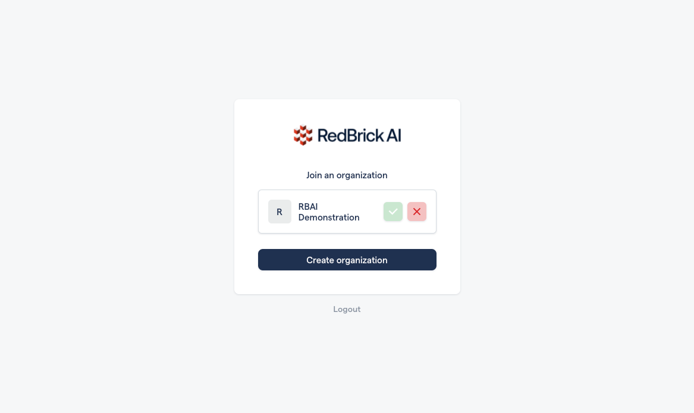

# What Is an Organization?

Organizations are containers within which all your efforts are managed. Organizations allow your to create a workspace in which you create projects and invite team members to collaborate on your efforts. When you log into the RedBrick AI platform you will be able to create an organization, or accept an invite to an organization. 

## Accepting an Organization Invite

If you have been invited to an organization, you should see the invite as soon as you log into your account. Once you accept the invite, it will be added to the list of organizations you are a part of. 


**Single Organization**\
\
By default, each user can **only create a single organization, **however you can be a part of multiple organizations (by accepting invites received by other organization admins). 



**Organization ID**\
****\
****Each organization has a unique ID associated with it. You might need your **organization ID** for various different things on the platform (like using the Python SDK). You can find your organization ID in the URL when you are logged into RedBrick AI. \
\
`https://app.redbrickai.com/<org_id>/`



**Trouble Receiving Organization Invites**\
\
When you are invited to an organization you should receive an **email invitation** with instructions detailing how you can create your account. Once you create your account, you can accept the invite as shown above. \
\
**If you don't receive an email invitation**, please check your spam, and if it's still not there, reach out to [contact@redbrickai.com](mailto:contact@redbrickai.com). 


