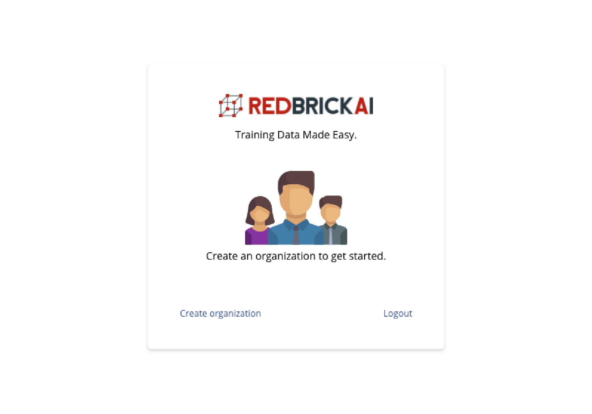

# What Is an Organization?

Organizations are containers within which projects, datasets, pipelines etc live. Permissions and collaboration on projects are handled within projects. When you log in to the RedBrick platform for the first time, you will be prompted to create an organization:

Once you create an organization, you will be able to invite members to collaborate with. 

## Organization Invites


**Coming Soon**


## Organization Settings


**Coming Soon**


