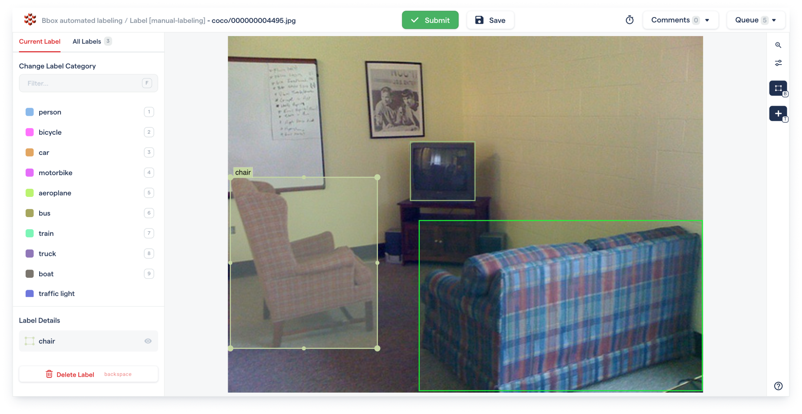
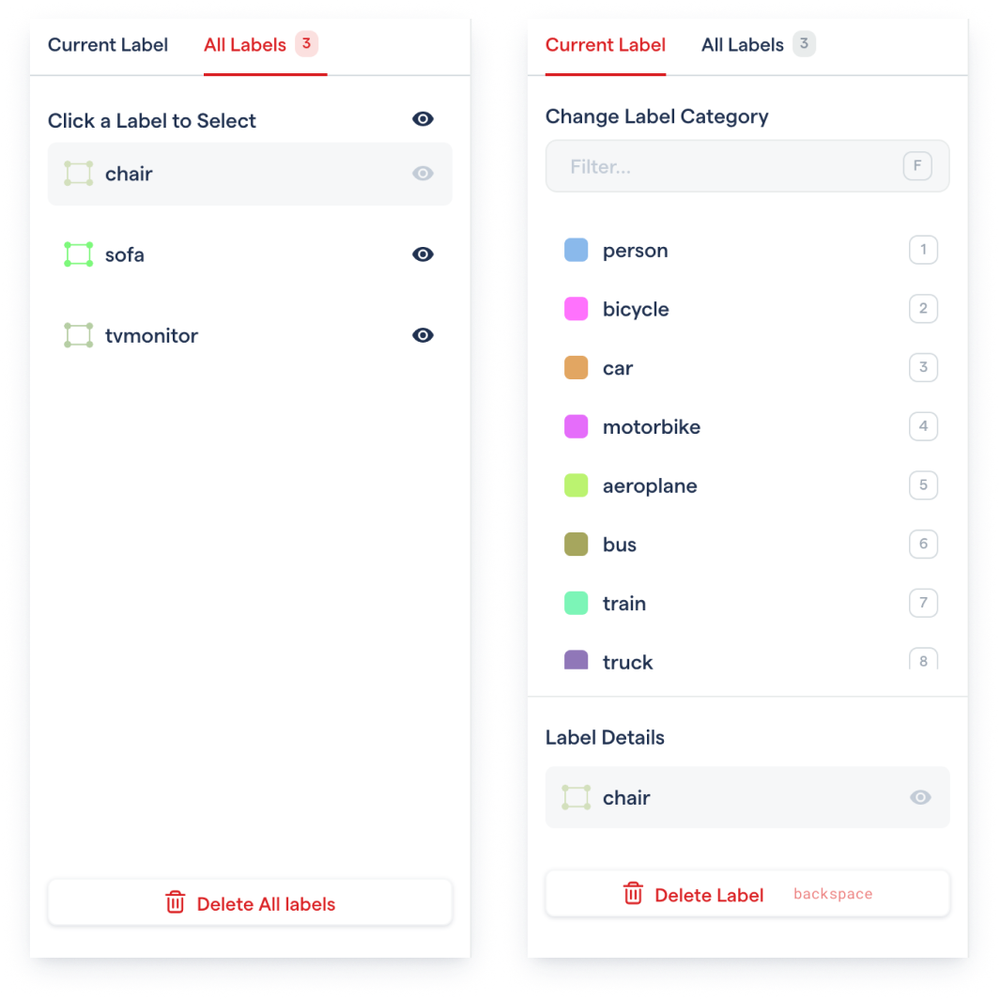
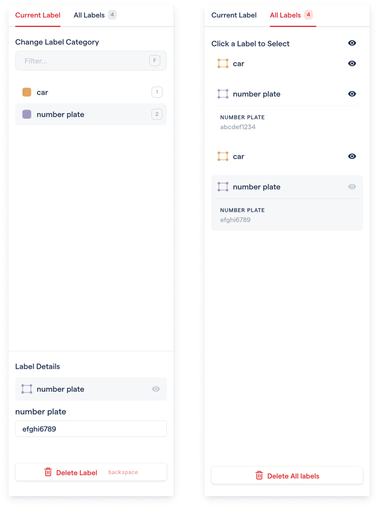

# July 2021

## &#x20;New labeling tool layout

The labeling tool has a simplified layout with three main components - the sidebar for label and category details, the top bar for task level actions, and the right bar for labeling tools.&#x20;


The **comments** and labeling **queue** are now on the top right of the top bar, with the **timer** visible on hover.&#x20;


## Updated Sidebar functionality

The sidebar now has two tabs - the **current label** section that includes information about the currently selected label, and the **all labels** section that includes information about.&#x20;

When no labels are selected, the Label Details will be empty. In this state, you can select a category from the list and interact with the canvas to **create a new label.** You can also select an existing label from the canvas, or the all labels list to **edit an existing label.**


**Double clicking** on a label item in the label list will take you directly to the Current label section with the label you clicked on selected.&#x20;


## Comprehensive shortcuts

There are new shortcuts for quickly accessing labeling tools, visit this page of the documentation to see a full list.&#x20;


[Broken link](broken-reference)


## Labeling attributes

For projects with label attributes, you have to select a label and the attribute can be edited in the Label Details section. You will also be able to see all the attributes on the label list.&#x20;

