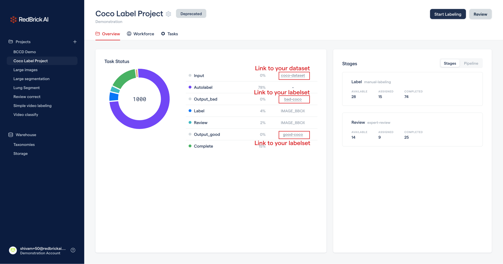

# June 2021

## Datasets and Labelsets moved inside Projects

The June 2021 release involves some major changes to the way the RedBrick AI platform is structured. The main change is, all datasets and labelsets have been moved inside projects. All old projects (created before June 20th 2021) will have a `deprecated` flag, and the datasets and labelsets can be found on the project dashboard.&#x20;




You can still **upload to old datasets** by visiting clicking on the dataset link on your project dashboard.&#x20;



Inside old datasets, you can upload data using the old items list format shown below.&#x20;

```javascript
[
    {
        "url": "folder/image.png",
        
        // unique, required for video, optional for images
        "name": "datapoint-name" 
    },
]
```

## New items list format

New projects (that don't have the deprecated tag, or are created after June 20 2021) have a new items list format. You can see the new format here:


[Broken link](broken-reference)


## New Project Creator

The project creator is new and improved, with an easy to use quick start option to easily configure projects, or an advanced creator to build a fully custom pipeline.&#x20;


