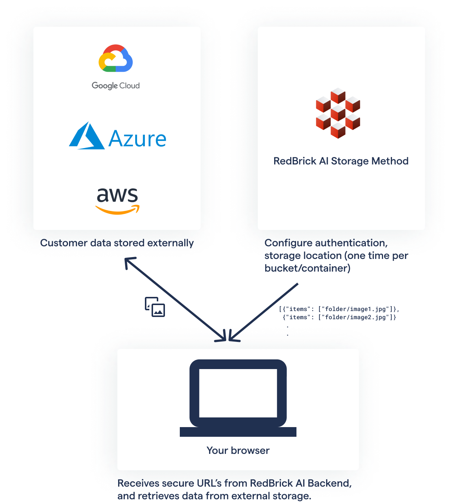
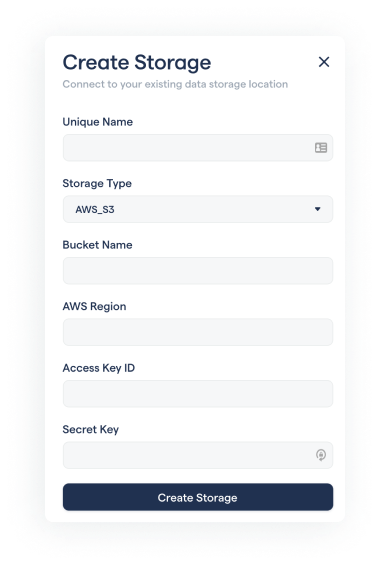
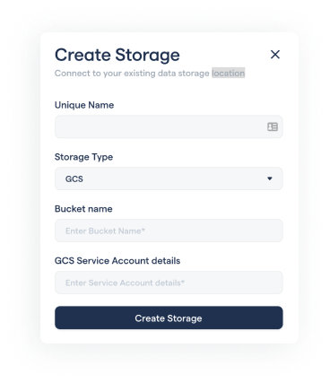

# Importing data

The data that you use with the RedBrick AI platform can be stored in a number of places, you can upload data directly to the platform or integrate an external storage method to store your data like Amazon S3, Google Cloud Platform, or Azure Blob Storage. By using your own external storage method, you can manage the storage of your raw data, including granular level access and privacy control.

You can see the external storage method data model on the RedBrick AI model. When data is stored externally, your raw data will never be routed via RedBrick AI servers, nor will it be downloaded/duplicated \(unless specifically requested for certain features, please review our [Privacy Policy](https://drive.google.com/drive/u/0/folders/1N-kAd4W8HD51TQiGP2D9cPhGAyD-mLIY)\). The data is transferred directly from your storage method to your browser. 



### Using external storage involves two steps

1. Configuring your [Storage Method](./#storage-methods) to specify data storage locations, and authentication information. 
2. Uploading an [Items List](./#uploading-an-items-list) containing specific URL's of the data from your storage method you wish to import. 

## Storage Methods

Currently, the options for external Storage Methods are:

* [AWS S3 Buckets](configuring-aws-s3-storage.md).
* [Google Cloud Storage.](configuring-google-cloud-storage.md)
* Azure Blob Storage.
* [Public](local-storage.md). This storage type includes data stored on your computer and data stored on any public server accessible by a URL. 

You can create a storage method by clicking on the _**Storage Method**_ on the left side bar of your account. On the storage method page, click on _Create Storage Method_. _****_



If your data is stored on a private S3 bucket, you will need to create a storage method of type _AWS\_S3_.



Please visit the Configuring AWS Storage for RedBrick AI section for a detailed walkthrough on how to generate all the required parameters. A brief overview of each parameter is provided here:

* `Unique name`: A unique identifier for this storage method.
* `Bucket Name`: The name of your AWS S3 Bucket.
* `Region`: The region code of the S3 bucket, e.g. us-east-2 \(US East Ohio\), ap-south-1 \(Asia Pacific Mumbai\). Check out the [aws docs](https://docs.aws.amazon.com/AWSEC2/latest/UserGuide/using-regions-availability-zones.html) for a list of all the region code.
* `Access Key`, `Secret Key`: The two keys that enable secure data operations. Follow along Configuring AWS Storage for RedBrick AI to generate the keys for your bucket.





Please visit the Configuring GCS Storage for RedBrick AI section for a detailed walkthrough on how to generate all the required parameters. A brief overview of each parameter is provided here:

* `Unique Name`: A unique identifier for this storage method.
* `Bucket Name`: The name of your GCS Bucket.
* `Service Account details`: A JSON key that provides RedBrick AI with adequate permissions to access data within the bucket. 




**Coming Soon!**




## Items List

The items list points the RedBrick AI platform to the data points in the data storage. This way you can selectively import data points from a storage method. The items list is a JSON file which comprises of a list of entries of the following format.

```javascript
{
    "items": ["<filepath_of_datapoint>"]
    "name": "<name_of_datapoint>" // Needs to be unique
                                  // Required for videos, optional for images
}
```


For **image uploads** the `items` array will have only a single entry.   
For **video uploads** the `items` array has to contain the frames of the video in order. 


Below are examples of single items list entries. 



Say your datapoint `image.png` is stored inside a folder named `folder` inside the `root-folder` inside a bucket, the item list entry for that datapoint will be.

```javascript
{ 
  "items": ["root-folder/sub-folder/image.png"] 
}
```



Say your data point `image.png` is stored inside a folder named `folder` which is being hosted using an http server on `http://127.0.0.1:8000/`, the item list entry for that datapoint will be.

```javascript
{
  "url": "http://127.0.0.1:8000/folder/image.png"
}
```



Say your datapoint is hosted at a public endpoint `https://path/to/data/image.png`, the item list entry for that datapoint will be.

```javascript
{
  "url": "https://path/to/data/image.png"
}
```




**Common Issue:** don't include bucket name in the file path.   
  
****When you configure your AWS S3, or GCS storage method, you will need to define the bucket name. The storage method is specific to a single bucket.   
  
Therefore, when you are creating your items list, make sure you don't include the bucket name in the path of the data point. The file paths **start from the root folder** inside your bucket


### Image Items List

The items list for importing images into the RedBrick AI platform is simply a list of item list entries. Each entry will be a single datapoint on the RedBrick AI platform. The item list below will import three data points into the RedBrick AI platform.

```javascript
  [
    {
      "items": ["root-folder/sub-folder/image1.png"] 
    },
    {
      "items": ["root-folder/sub-folder/image2.png"] 
    },
    {
      "items": ["root-folder/sub-folder/image3.png"] 
    }
  ]
```

### Video Items List

The items list for importing images into the RedBrick AI platform is slightly different than images. Videos have to be parsed into frames and be imported into the RedBrick AI platform. Say you have two videos - `video1`, `video2`, that you want to import into the platform, and each video has three frames - `frame1.png`, `frame2.png`, `frame3.png`. The items list for this would be.

```javascript
[
  {
    "name": "video-1",
    "items": [
      "root-folder/video-1/frame1.png",
      "root-folder/video-1/frame2.png",
      "root-folder/video-1/frame3.png",
    ]
  },
  {
    "name": "video-2",
    "items": [
      "root-folder/video-2/frame1.png",
      "root-folder/video-2/frame2.png",
      "root-folder/video-2/frame3.png",
    ]
  }
]
```

Using this items list, two video data points \(video1, video2\) will be imported into the platform with three frames each. The frames of each video will be ordered in the same order as their appearance in the items list.

