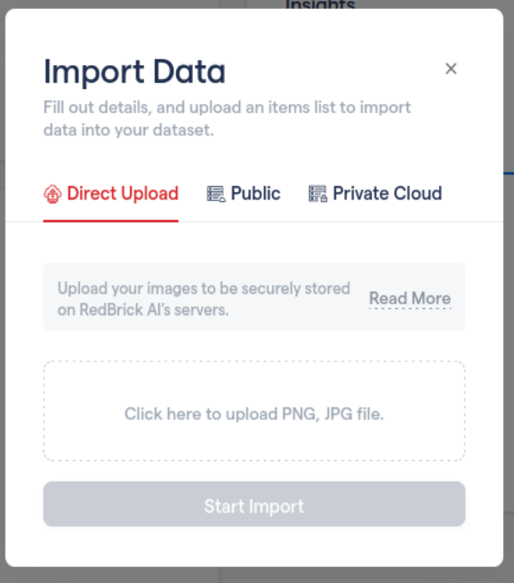
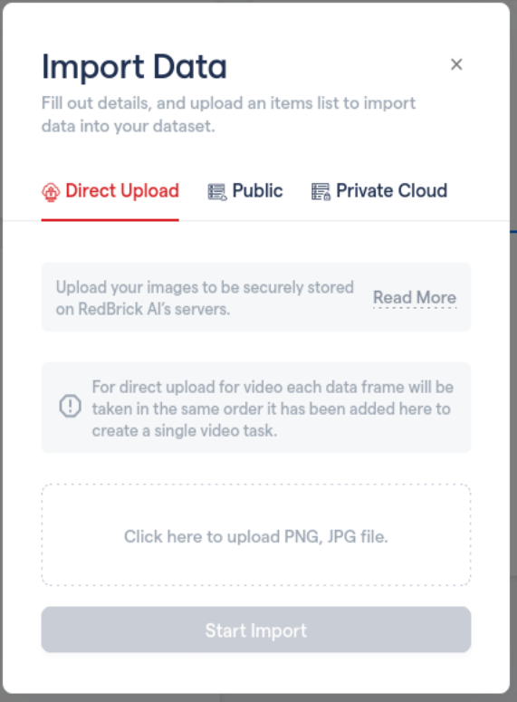

# Direct Upload

## Adding Files for **D**irect Upload

This section will cover how to get started immediately by uploading files directly to our RedBrickAI servers for use via Direct Upload.

## Image or Document Projects

This is a simple process of just uploading the files that you want to use to create tasks. Each file will be made into a task that can be used further in your project pipeline. The task will have its name set by default to the file name.


Files that are uploaded with the same file name to a single project will fail. Each file must have a unique name. 




Each file uploaded will be made into its own task. As shown in the image below, `pricinglvl2.png` and `pricinglvl3.png` will be made into separate tasks respectively. Simply click _Start Import _and you are ready to go!

.PNG>)

## Video Projects (Beta)

For video, we accept a set of frames uploaded to generate one video task. Here we expect that the video can be split up into its frames by the user and then selected to upload to our platform. There are multiple ways of doing it but perhaps the easiest is the use [ffmpeg](https://www.ffmpeg.org), a complete, cross-platform solution to record, convert and stream audio and video. 

After installation a simple command as shown below may be run to generate image frames from the video. Here `video.mp4`is the desired video to split up, the `fps` is the frame rate parameter used by_** **ffmpeg_ and the `image` folder is where all the images shall be stored post processing.

```javascript
ffmpeg -i video.mp4 -vf fps=1 image/output%06d.png
```

After the frames have been generated, they can simply be uploaded via the direct upload feature to our servers to generate a video task.




As shown in the image below, `pricinglvl1.png` and `pricinglvl2.png` and `pricinglvl3.png` will be frame 1,2 and 3 respectively of the uploaded video task. Currently, the name of the task is by default set to the name of the first frame uploaded. In this case, the name of the task will be _pricinglvl1.png_. Simply click _Start Import _and you are ready to go!


Video Upload Drawback. \
\
Only one task may be uploaded at a time using the direct upload feature. The order of the frames in the video will be decided based on the order in which the files are added to through the direct upload step. 


.PNG>)

