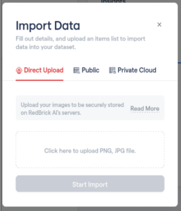
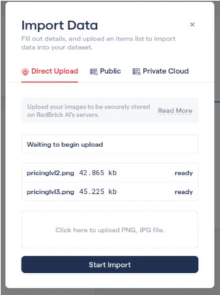

# Direct Upload

## Adding Files for **D**irect Upload

This section will cover how to get started immediately by uploading files directly to our RedBrickAI servers for use via Direct Upload. This storage type allows you to store your data securely on RedBrick AI servers without having to configure your own storage method. This will automatically upload your data to our secure cloud and create tasks for your projects without any further setup steps.

## Image or Document Projects

This is a simple process of just uploading the files that you want to use to create tasks. Each file will be made into a task that can be used further in your project pipeline. The task will have its name set by default to the file name.


Files that are uploaded with the same file name to a single project will fail. Each file must have a unique name.&#x20;


Each file uploaded will be made into its own task. As shown in the image below, `pricinglvl2.png` and `pricinglvl3.png` will be made into separate tasks respectively. Simply click _Start Import _and you are ready to go!

## Video Projects 

For video projects you can upload MP4 files and we will handle the parsing down to frames. Videos will be split into frames at the full frame rate of the videos. Any frames beyond the first 5000 will be removed. It is strongly recommended to keep video clips shorter to assist annotators.&#x20;
