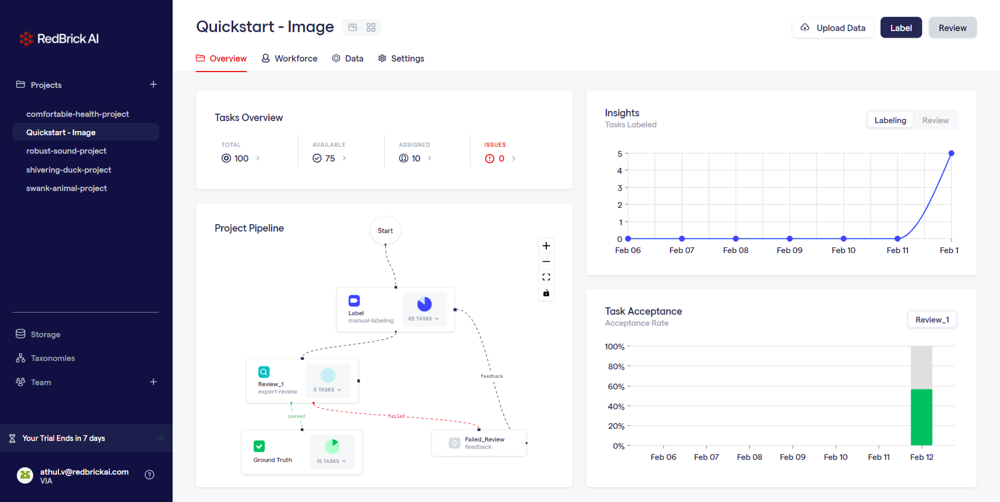
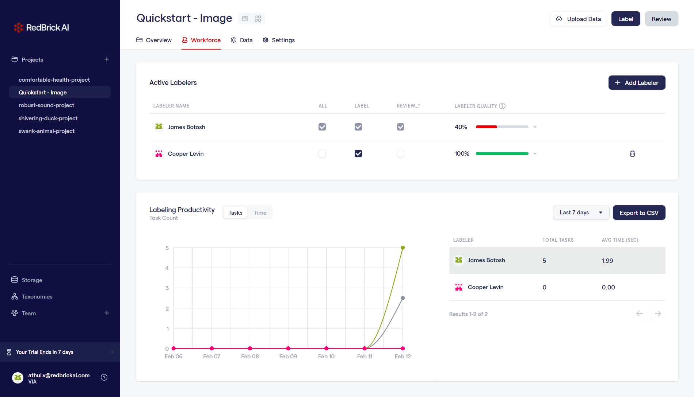
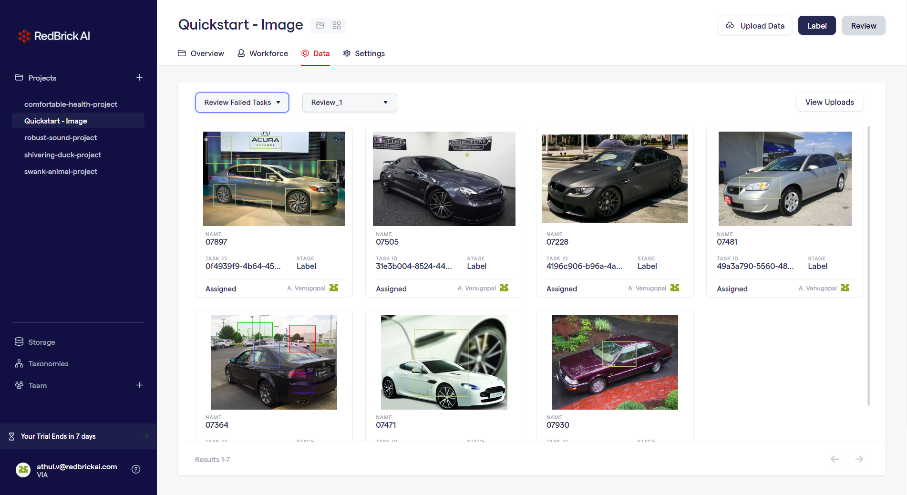

# Overview

Projects are mainly defined by the following:&#x20;

1. The type of data you're working with `image` or `video`
2. The type of labels you're working with `bounding box` , `segmentation` etc. (see [this](../data-labeling/overview.md) for a complete list of supported label types.)&#x20;
3. The [project pipeline](overview.md#what-is-a-pipeline).
4. The project raw data.&#x20;

## What is a Pipeline?

The RedBrick AI pipelines are a framework that you can use to structure and automate your data efforts. You can think of the pipelines like a manufacturing assembly line where there is a product that goes through various discrete processes, that involve various automated and manual processes, before being completed.&#x20;

Similarly, pipelines are a production line for your data, where you can stitch together multiple stages based on configurable logic to run automated and manual processes to label your data.&#x20;


Each project has **a single pipeline** associated with it, that defines the process of that project.&#x20;



**What is a task?**

Each datapoint that you upload into your project is created into a **task** inside a stage. Each task can have the following states:&#x20;

1. `ASSIGNED -` Assigned to a user, for example a labeling or review task. ``&#x20;
2. `UNASSIGNED -` Queued in the stage, but currently not assigned to any user.
3. `COMPLETED -` Has finished processing through the stage.
4. `IN PROGRESS -` Is currently going through the stage, e.g. when a user saves a labeling task, it gets marked `IN PROGRESS`.


You can see an example pipeline above, which involves a single labeling stage, followed by two review stages for quality assurance. The data you upload to the project, will flow through the pipeline following the logic laid out in the diagram. At each stage, a **task** is created and completed before moving to the next stage.&#x20;

## Project Dashboard

Your project dashboard contains all the information you need for managing your projects. Your project dashboard has a few sections:&#x20;

### Overview

The overview tab includes high level information regarding the status of your project.&#x20;

1. Tasks Overview - The status of data in your project
2. Project Pipeline - The basic framework of your project
3. Insights - Data plot conveying the total label & review tasks completed per day
4. Task Acceptance - Percentage rate of accepted against rejected tasks

### Workforce

The workforce tab contains information about your team's progress & performance within a project.

1. Active Labelers - Gives you a project level overview and control over the team members
2. Labelling Productivity - View the total time and tasks _****_ completed over the last 30 days&#x20;

### Data

The data page consists of all the tasks in a particular project. The filter system within the page further helps you to navigate across the different tasks based on type.

View the section on importing data to understand how to import data into your project.&#x20;


[importing-data](importing-data/)

