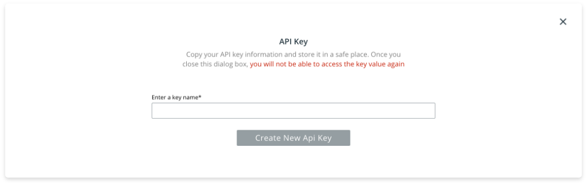

# SDK Overview

The RedBrick Python SDK is a tool to interact programmatically with the RedBrick AI platform. The SDK can is a developer friendly way to carry out key operations like data and label export.


The RedBrick SDK works on Mac, windows, and linux, and is available on [pypi](https://pypi.org/project/redbrick-sdk/). The SDK is compatible with **Python 3.7.0+.** 


### Getting Started

Follow the steps below to get started with the RedBrick SDK.

**Step 1: Generate an api key**

You can create an API key for your organization under _Organization Settings_, which is accessible by clicking on the top left corner of the screen.



Once you create an API key, make sure to store it safely, because you will not be able to look up the key value once you close the dialog box.

**Step 2: Install the RedBrick SDK**

You can install the sdk by using pip.

```bash
$ pip install -U redbrick-sdk
```

**Step 3: Initialize the RedBrick SDK in Python**

To use the SDK, you need to initialize it.

```python
import redbrick

redbrick.init(api_key="<your_api_key>")
```

