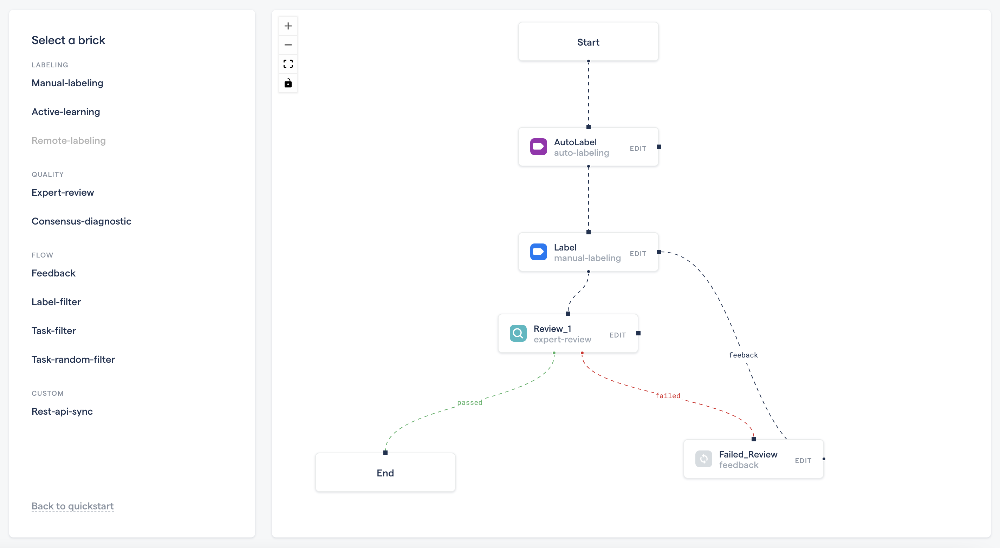
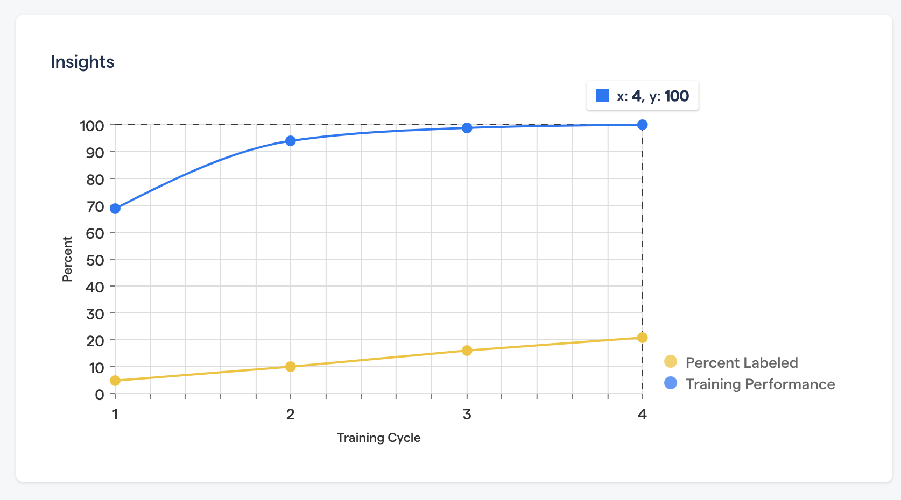

# Outbound Process and Templates

## Prospecting \(Sending Connections\)

1. Open LinkedIn Sales Navigator using the account you are assigned to. 
2. Apply the relevant filters for the persona we are targeting \(go through the correct [personas](prospecting.md#what-is-the-correct-persona) for reference\). A typical search looks like this:
   1. Enter keywords in the search for an exact string match - "computer vision".
   2. Select the targeted geographical areas - "North America", "Asia" etc. 
   3. Select the company headcount/size - usually all the companies between 10 to 10,000 works
   4. Remove leads that you've already saved or reached out to. 
3. Identify a relevant company by seeing if the employ computer vision engineers. Once you have found a[ relevant company](prospecting.md#company-persona), visit their LinkedIn sales navigator page. Within the employees list, look for the [Lead Engineers, and CXO personas](prospecting.md#employee-persona). 
4. While sending connection request to someone you could also do the following to find more prospects easily: 

   1. Look at the previous experience of the prospect. You'll probably find more companies that use computer vision.

## Sending Messages \(Lead Generation\)

The entire process of sending messages right now consists of cold messaging and then doing **three follow-ups** with an interval of at least **3 days.** 

### Sending the first message

1. Open the "Connections" page from the homepage of LinkedIn, it should be on the left under the profile photo. 
2. Refer to the [Google Sheet](https://docs.google.com/spreadsheets/d/1HIU79tbR2qKaJlVwaPyZX6_Uja08K02o6L3jEkd27X4/edit?ts=5f22bb5f#gid=0) to check who was the last person a message was sent to. 
3. Start sending the first message continuing from where it was left \(preferably start from the bottom and move upwards because that way you won't miss people in between\). 
4. Update the [Google Sheet](https://docs.google.com/spreadsheets/d/1HIU79tbR2qKaJlVwaPyZX6_Uja08K02o6L3jEkd27X4/edit?ts=5f22bb5f#gid=0):
   1. Fill in the the name and other details of the person. 
   2. If the cell having the name turns DARK GRAY, it means we’ve already sent an email to someone with the same name:
      1. Use the Find feature \(`ctrl+F`\) inside the sheet to look at other people with the same name
      2. Check if the person you’re messaging right now is different and is not being re-messaged 
   3. If the entire row turns **GRAY**, it means that either the company is already on a demo, and therefore **do not message them.** 
   4. Now if we haven’t messaged the person before \(**Step 2**\) and if the row doesn’t turn Grey \(**Step 3**\) on entering the name of the company, that means that we're good to reach out to the person. 
5. Copy and paste the template \(attached below\) replacing the parameters in italics according to the information on the prospect's profile and send the first message.

### Sending the follow ups

1. Open the profiles with the status _sent_ in the [Google Sheet](https://docs.google.com/spreadsheets/d/1HIU79tbR2qKaJlVwaPyZX6_Uja08K02o6L3jEkd27X4/edit?ts=5f22bb5f#gid=0) ****and if the person has not replied to the first message, copy paste the **follow up 1** template and send it after changing the parameters in the template. Update the status as _followup_. 
2.  If the status is _followup_ and if the person hasn't replied yet, then do the same but use the **follow up 2 template** and update the status  as _f2._ 
3. If the status is _f2_ and if the person hasn't replied yet, then do the same using **follow up 3 template** and update the Status at _f3._ 

## Cold Message Templates


**Introductory message**  
  
Hi _&lt;first name&gt;_,

I’m reaching out to you because I'm trying to learn more about the challenges teams face in creating and managing vision training data. As a _&lt;position&gt;_ at _&lt;company name&gt;_, I thought you would be the right person to talk to about this \(if not, could you direct me to the right person?\).

Have you and your team figured out a process that works well - do you manage all labeling and data management efforts in house?



**Follow up 1**  
  
Hi _&lt;first name&gt;_,

I trust that you have had an opportunity to read my previous message, so I figured it’d be worth checking in with you again. I’m the co-founder of RedBrick AI \(https://redbrickai.com\), which is a software platform for creating and managing vision training data. 

Teams use the platform to structure, automate and qualify their labeling efforts. From your profile, it looked like you might be involved in this effort at _&lt;company name&gt;_.

Is this something your team manages in-house with custom-built tools? If yes, has this process worked well?

Regards,



**Follow up 2**  
  
Hey _&lt;first name&gt;_! How’s it going?

I just wanted to know if you’ve had the time to check out our website. I’d love to discuss any challenges your team faces in this space. At the very least we could have a meaningful conversation about this space, and I’d also love to show you what our team at RedBrick AI is working on. 

Would you have 20 minutes either this week or next week?



**Follow up 3**  
  
Hi _&lt;first name&gt;_!

I just wanted to touch base with you once more, and see if this is relevant/of interest to you. I’d love to discuss if/how RedBrick AI could add value to your current workflow, and would be happy to offer a free trial of our platform to demonstrate the capabilities. 

Look forward to hearing from you!


## 

## Generic Message 


**To a LinkedIn connection**  
  
Hi &lt;first name&gt;!   
  
Thanks for the accepting the connection request! I'm shooting in the dark, but from your LinkedIn profile I figured you'd be involved with the data-labeling efforts at &lt;company name&gt; \(or could direct me to the right person\). I was curious to understand how your team labels data and manages the process?   
  
I'm the co-founder of RedBrick AI - our platform \([https://redbrickai.com](https://redbrickai.com/)\) is used by teams to automate and structure their computer vision data-labeling efforts - our customers have seen upto 80% automation in the manual efforts. Teams also  leverage our data-management, collaboration, and pipelining features to build robust, scalable, and qualified labeling workflows.   
  
If you get a chance to look through our website, i'd love to get your feedback and know if this seems interesting for your team? Would you be open to explore?


## Healthcare Message


**To a LinkedIn connection**

Hi &lt;first name&gt;!   
  
Thanks for the accepting the connection request! I'm shooting in the dark, but from your LinkedIn profile I figured you'd be involved with the data-labeling efforts at &lt;company name&gt; \(or could direct me to the right person\). I was curious to understand how your team labels data and manages the process?   
  
I'm the co-founder of RedBrick AI - our platform \([https://redbrickai.com](https://redbrickai.com/)\) is used by teams to automate and structure their computer vision data-labeling efforts - our healthcare customers have seen upto 80% automation in the manual efforts.   
  
Specifically, in the healthcare space, teams are able to easily enable collaboration between clinicians/annotators/engineers, can project manage complex review workflows, while leverage automation through Active Learning strategies.   
  
If you get a chance to look through our website, i'd love to get your feedback and know if this seems interesting for your team? Would you be open to ex


## Email Templates


**First Email**

**Skeleton**:

Hi \_\_\_\_\_\_,

**Email hook**- Based on our own research on the company and prospect. For example, if the prospect has spoken about something in a conference/article that is relevant to what we do.   
  
Alternatively, it can be a generic hook regarding a common pain-point that prospect's industry faces with regards to data labelling etc.  
  
**Main Body**- Brief introduction of Redbrick and how it can be useful to address the pain point \(mentioned in the hook\).  
  
**Call to action**- Close ended action statement- asking prospect for a time slot for product demo/ sharing calendar link. Define clear cut timelines.

**Template Example \(for a healthcare CXO\)**:  
  
Hi XYZ,

\(**Not accepted**\) I came across your profile on LinkedIn and was interested to connect to understand more about the data efforts at &lt;company name&gt;.  
  
\(**Accepted**\) Thanks for the accepting the LinkedIn connection request!   
  
\(**Hook based on company/industry**\) While engaging with other professionals applying computer vision in healthcare, we've noticed that teams struggle specifically with expensive nature of expert labeling, ad-hoc QA processes  and difficulty collaborating effectively. I'm curious how your team manages these efforts?  
  
To address these issues, we have built RedBrick AI - a software platform to structure, automate and qualify labeling efforts. Our current small and enterprise customers have seen up to 80% automation in their manual efforts and an order of magnitude increase in label quality.    
  
If you had the chance to visit our website \(https://redbrickai.com\) i'm curious if it's relevant? Would you be open to a short conversation this week/next week? Feel free to book a slot on my calendar.  
  
Regards,


### Hooks


**Generic**

While engaging with other professionals applying computer vision in &lt;industry&gt;, we've noticed that teams struggle with ad-hoc and manual labeling processes. I'm curious how your team manages these efforts?



**Healthcare**

While engaging with other professionals applying computer vision in healthcare, we've noticed that teams struggle specifically with expensive nature of expert labeling, ad-hoc QA processes  and difficulty collaborating effectively. I'm curious how your team manages these efforts?


### Follow ups


**Follow up email \(based on 'structure' use case\):**  
  
Hi XYZ,  
  
I hope you had a chance to review my previous email. I wanted to touch base with you quickly covering some of the problems we solve for our current customers.  
  
Our customers usually have multi-step labeling processes involving several stakeholders. Teams use our pipelining framework to easily structure their efforts and build robust processes that are able to leverage automation, QA processes, and our workforce of 400+ labelers.    
  
The screenshot below covers a common semi-automated workflow.  
  
\[Attach relevant screenshot\]  
  
I'm curious if this seems interesting? If you'd be open to it, i'd love to get on a quick call and demonstrate the functionality this week or early next week. Feel free to select a time in my calendar link below, or let me know if there's a specific time you'd be open to. Looking forward to it!  
  
Regards,



**Followup email\(based on 'automate' use case\)**:  
  
  
Hi XYZ,  
  
One of the most common problems our current customers used to face was the time and effort it took to manually label a dataset, and the difficulty in automating the process. To solve this, our platform \(https://redbrickai.com\), offers state of the art tools to help teams automate up to 80% their efforts through a human-in-the-loop / Active Learning approach.   
  
We have partnered with Samsung SDS to offer teams with a simple to use high-performance Active Learning solution - iteratively label the smallest informative portion of your dataset, and automate the rest. You can also easily integrate your own models into the RedBrick AI platform to iteratively label, and train.  
  
  &lt;screenshots below&gt;  
  
We have several other features that are targeted to reduce the manual effort in labeling data. If you are intrigued, I would be glad to show you these features and much more over a short 30 minute call. Would you be open to connect this week / next week? Alternatively, feel free to book a slot on my calendar. Looking forward to our conversation.  
  
Regards,  
\_\_\_\_\_\_\_\_\_\_\_\_


Our AL solution automated the labeling with 100% accuracy after only 20% manual labeling \(real healthcare dataset\).


**Follow up email\(based on 'qualify and collaborate' use case\)**  
  
Hi XYZ,  
  
Till now, we have shown how you can use Redbrick to structure and maintain workflows and automate your data labelling processes.   
  
With the help of our platform, you can have your entire team working with same tool and processes from a single platform. Not only this, you can assign your team members with varying permission levels to manager your labelling processes. This way, you can also monitor their performance through deep insight tools available to you.  
  
\[Attach screenshot\]  
  
I would be glad to show you these features and much more over a short 30 mins call. Let me know of a convenient time slot and I will share an invite accordingly. Alternatively, feel free to book a slot on my calendar. Looking forward to our conversation.  
  
Regards,  
\_\_\_\_\_\_\_\_\_

  
****


