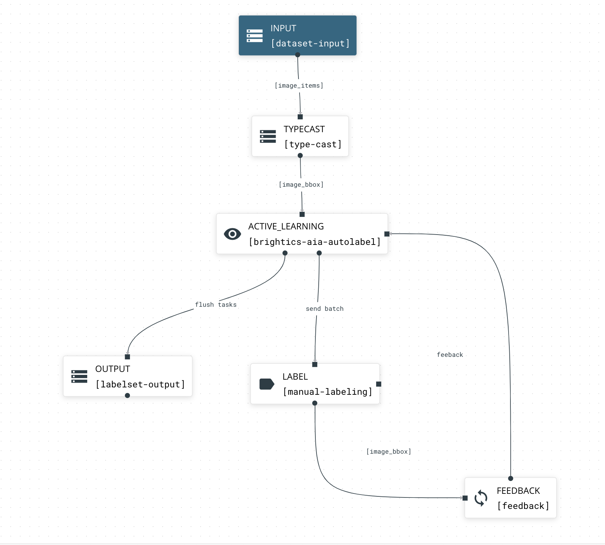
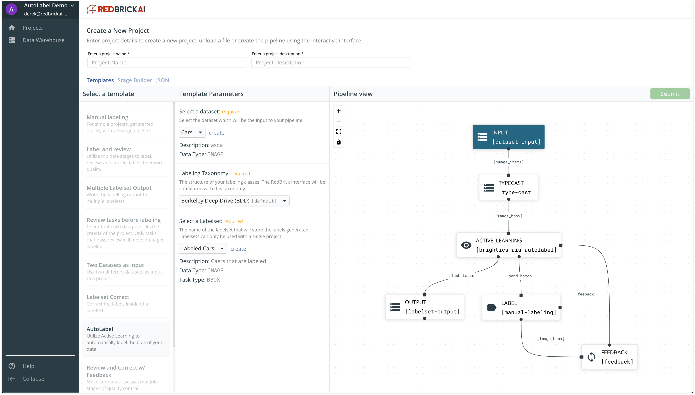
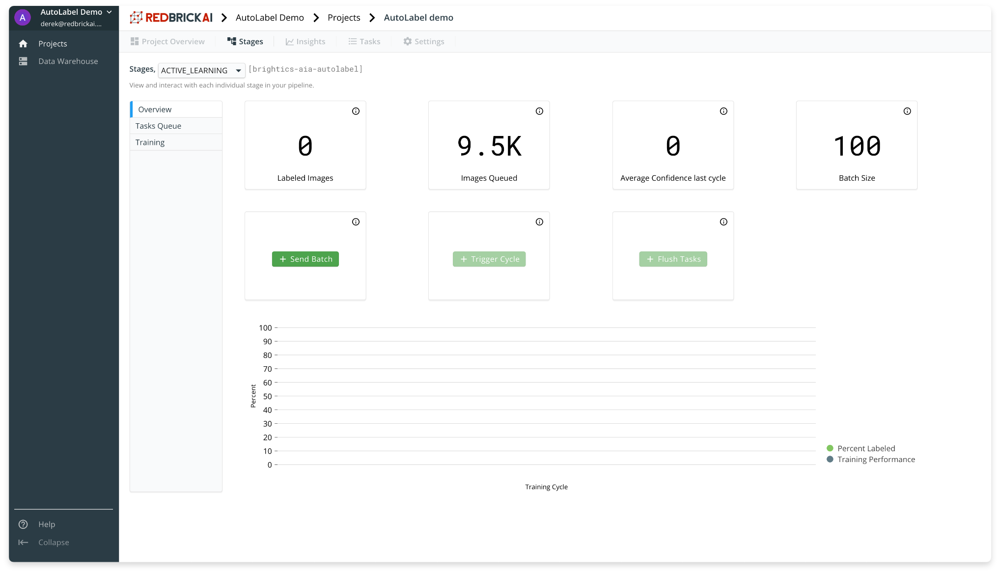
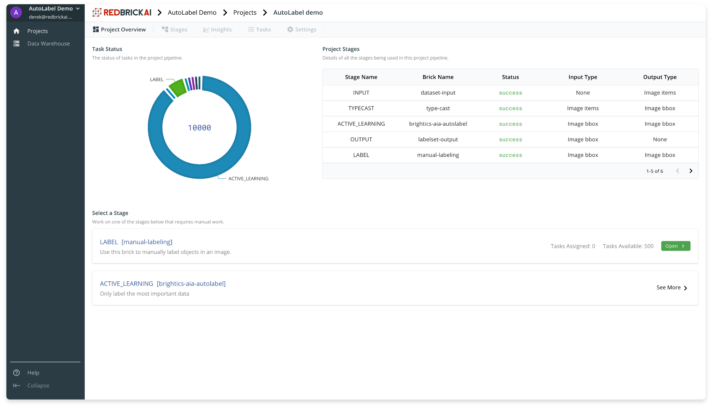
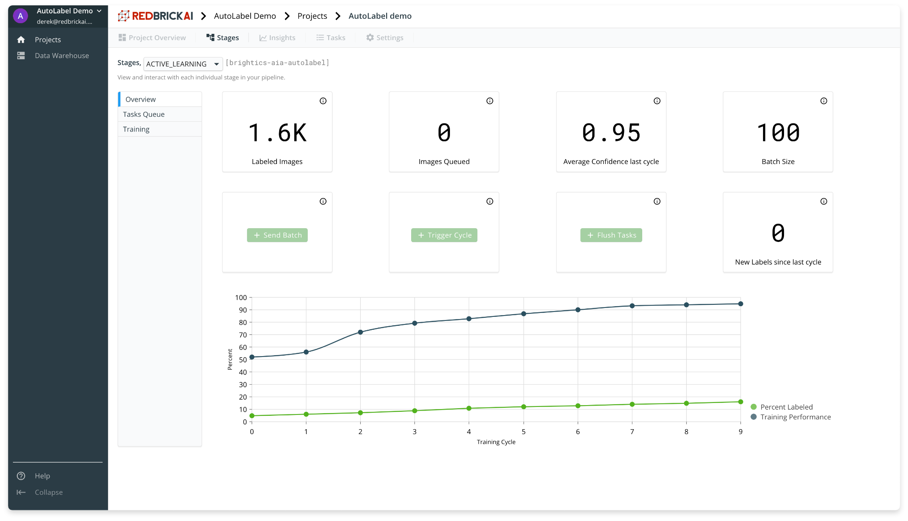

# Active Learning with Samsung SDS AutoLabel

This tutorial will walk you through how to use Samsung SDS AutoLabel to run an active learning workflow which can automate upto 80-90% of all manual labeling work.  


This Active Learning solution is currently in **Beta phase**, and will be available at [https://brightics.redbrickai.com](https://brightics.redbrickai.com). Currently the offering only supports **image bounding boxes,** but will be expanded to other label types soon. 

If you are interested in trying this solution, please write to us at [contact@redbrickai.com](mailto:contact@redbrickai.com)


## **What is Active Learning?**

The key idea behind active learning is that a machine learning algorithm can perform better with less labeled training data if it allowed to _choose_ the data from which it learns. An Active Learner interactively queries a human annotator to first label data points that it is uncertain about. \([Burr Seatles, Active Learning](https://www.morganclaypool.com/doi/pdf/10.2200/S00429ED1V01Y201207AIM018)\)  
  
Following this interactive and iterative process, you can label data _in order of information gain_ to the Active Learner, therefore eliminating the need to label data-points the _Active Learner can auto-label_. In practice, this approach is able to save 80-90% of manual labeling efforts required to label a dataset.  
  
Automation within this Active Learning framework is achieved in two different ways: 

1. Data points the Active Learner is already confident about don't have to be manually labeled by humans because they have already been accurately auto-labeled.  
2. Throughout the active learning iterations, the human annotator\(s\) will simply be _correcting_ low confidence predictions of the Active Learner. As time progresses, even the low confidence predictions of the Active Learner will require less and less corrections. Therefore, the average time spent to create a label reduces over time. 


The **Active Learner** in this Active Learning workflow is the **Samsung SDS AutoLabel** algorithm. 


## Overview

Before diving into the step-by-step process of setting up your Active Learning project, let's have a look at what the workflow looks like, and understand what the different stages are, and their inner workings. 

#### INPUT `[dataset-input]`

The first stage brings in data from the [Data Warehouse](../data-warehouse-1/overview.md) into your pipeline.

#### TYPECAST `[type-cast]`

The `type-cast` is used in this pipeline to ensure this pipeline abides by the RedBrick AI pipeline framework rules - specifically, the two inputs into the `[brightics-aia-autolabel]` stage need to be the same i.e. `image_bbox`.

#### ACTIVE\_LEARNING `[brightics-aia-autolabel]`

The `[brightics-aia-autolabel]` stage is the core component of this Active Learning pipeline. This stage integrates with the Samsung SDS AutoLabel algorithm for training and generating predictions/confidence estimates.   
  
The `[brightics-aia-autolabel]` stage has two sub-components to it, which are described below:

1. **Task Queue.** The task queue contains all the data/labels queued in this stage, with the lowest confidence tasks at the top of the queue. Before AutoLabel has been trained and generated predictions with confidences, the queue is randomly sorted.  
2. **Training Set.** Tasks that have been manually labeled get added to the training set. AutoLabel is trained on this training set.

Within this stage, there are three possible actions which are covered below: 

1. **Send Batch.** The send batch action sends a batch of data, from the top of the task queue inside `[brightics-aia-autolabel]` , to the downstream `[manual-labeling]` step.  
2. **Trigger Training.** The trigger training action trains AutoLabel using the labeled data inside the training set. At the end of a training cycle, AutoLabel will generate predictions with confidence values on the task queue. The task queue will be re-ordered to have the least confident predictions at the top of the queue at the end of every training cycle.  
3. **Flush Tasks.** The flush task action sends all the tasks \(data and labels\) queued in `[brightics-aia-autolabel]` to the `[labelset-output]` stage to be stored in the Data Warehouse. 

#### LABEL `[manual-label]`

The manual labeling stage allows your team to manually label the data, or correct data that already has predictions on it. This step can be done collaboratively by inviting team members to your organization.

#### FEEDBACK `[feedback]`

The feedback step simply sends labeled tasks back to the `[brightics-aia-autolabel]` step to be added to the training set. 

**OUTPUT `[labelset-output]`**

Once tasks are flushed, the `[labelset-output]` stage stores all the data and labels in the Data Warehouse.

##  Set up your account

Visit [https://brightics.redbrickai.com/login](https://brightics.redbrickai.com/login) to log into your RedBrick account. If you don't have an account, contact us at [contact@redbrickai.com](mailto:contact@redbrickai.com). Once you have added all your relevant details and signed up for an account, you will be directed to the [organizations page](../organizations/what-is-an-organization.md) to create an organization. 



## Prepare your dataset

Inside the data warehouse, you can create a [dataset](../data-warehouse-1/creating.md#datasets) and [storage method](../data-warehouse-1/storage-methods.md) to import data from your AWS S3 bucket into the RedBrick platform. Follow the guide below for preparing your AWS S3 bucket to integrate with the Data Warehouse.



## Create the Active Learning Project

Once you have created a dataset, and imported data into the warehouse from your AWS S3 bucket, head over to the projects page, and click on Create Project.

Within the project creation page, select the **AutoLabel** template pipeline. You will need to fill out the following template parameters to successfully create your project: 

1. **Dataset:** Select the name of the dataset you would like to work with for this project.  
2. **Labeling Taxonomy:** Select your labeling class [taxonomy](../data-warehouse-1/taxonomies.md) for the data you are working with. You can [create custom taxonomies](../data-warehouse-1/taxonomies.md#creating-a-taxonomy) inside the data warehouse.  
3. **Labelset:** Select or create a labelset container to store the final data and labels. 

Once you have filled out the required template parameters, and added a name and description to the project, you can submit it to create it. 

## Active Learning Dashboard

Inside the project you just created, within the _Stages_ tab, you can select ACTIVE\_LEARNING from the drop down to visit the dashboard for the `[brightics-aia-autolabel]` stage. As you can see in the image below, this dashboard contains all relevant active learning actions and statistics.

## Label, Train, Correct

Now that you have created a project and are acquainted with the dashboard, you can begin the active learning process by _sending a batch_ to be manually labeled. Once you send a batch, you will notice the pipeline status on the main dashboard would have updated with tasks queued in the LABEL step. Your team can go ahead and collaboratively label these data-points in the LABEL stage. 

Once you have labeled an adequate number of data-points, you can trigger a training cycle, inside the active learning dashboard to train AutoLabel and generate predictions on the tasks queue in `[brightics-aia-autolabel]`.   
  
After a number of training cycles, and batches of manual labeling your project will progress in a similar way to the graph shown below. 

From the plot above you can see that you can expect the AutoLabel confidence to approach 100% confidence after a number of training cycles and only a small percentage of data manually labeled.   
  
Once you are satisfied with AutoLabel's performance, you can _Flush Tasks ****_to store all the data and labels in the Data Warehouse. Finally, your labels can be exported using the [Python SDK](../python-sdk/labelset/) straight to the machine you wish you store your labels on.

